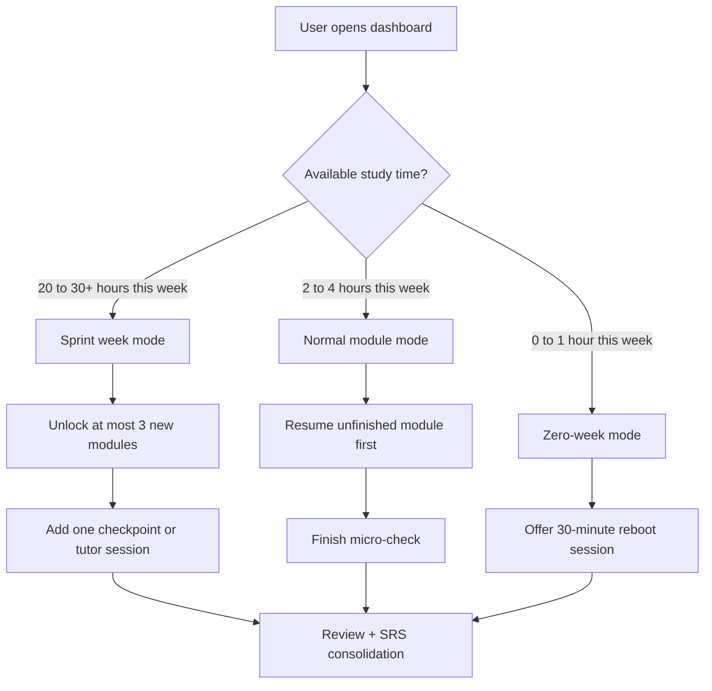
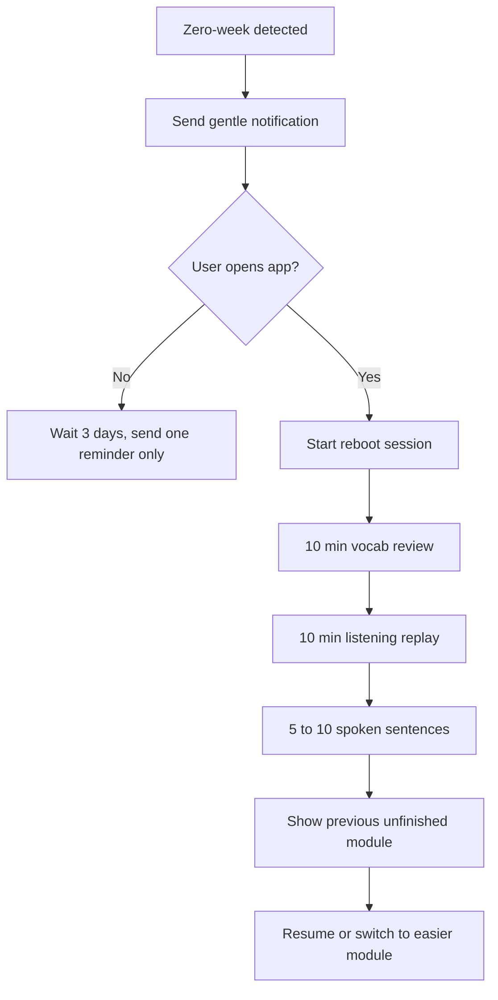
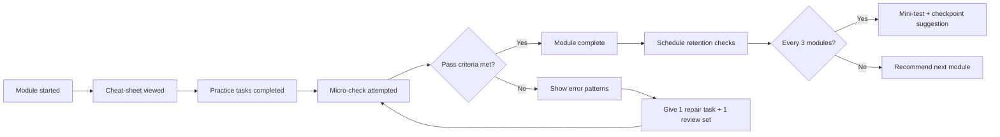
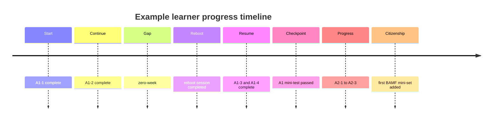
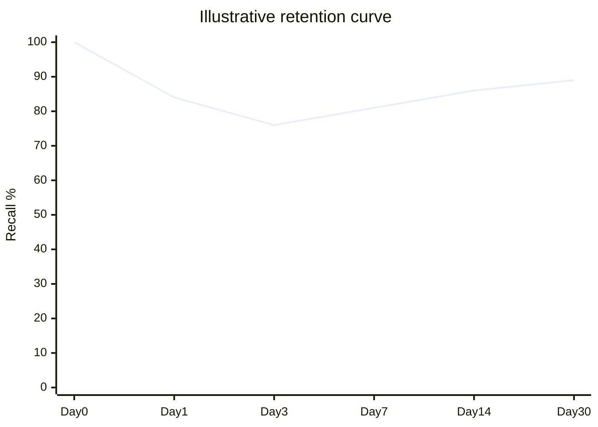
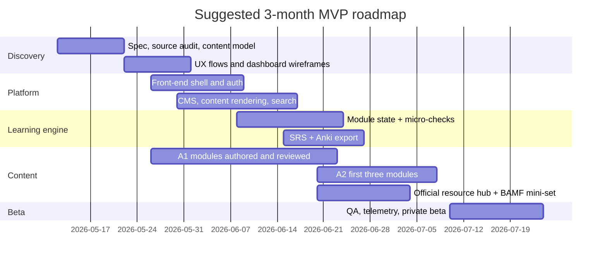

# Web app blueprint for a flexible module-based path from zero to German B1 for citizenship

## Executive summary

The product should be built around **modules, not calendar weeks**. That is the right design choice for the target user: someone aiming for **German B1 for citizenship in** entity["country","Germany","country in Europe"], but studying in irregular bursts rather than on a steady weekly schedule. The official constraints are clear: for citizenship, learners normally need **B1 German** and proof of civic knowledge, typically via the **naturalisation test**; if they complete an integration course and reach **B1 in the DTZ** plus pass **Leben in Deutschland**, the **Zertifikat Integrationskurs** can serve as combined evidence. The naturalisation test is **33 questions in 60 minutes**, with **17 correct answers required to pass**. BAMF also publishes a recognised list of B1 certificates including **Goethe-Zertifikat B1**, **telc Deutsch B1**, **ÖSD Zertifikat B1**, and **DTZ B1**. citeturn14view2turn14view1turn14view0

For the app, the best product thesis is this: **one module = one page = one achievable unit of progress**. The module shelf should map directly to real-world life topics that BAMF already highlights in integration courses—work, shopping, health, housing, forms, calls, job applications—and to Goethe’s A1–B1 “can-do” progression. Goethe’s own B1 page also states that B1 candidates typically need roughly **350 to 650 teaching units of 45 minutes** to reach the level, which is about **262.5 to 487.5 hours**; that makes a burst-friendly, resumable design much more realistic than a rigid “12 steady weeks” plan. citeturn21view1turn2search5turn14view3turn22calculator0turn22calculator1

The recommended product shape is a **web-first learning system** with five pillars: a module library, bilingual cheat sheets in English and Traditional Chinese, short micro-checks after every module, an embedded or exportable spaced-repetition layer, and curated official exam/citizenship resources. For MVP, do **not** depend on official provider APIs: the official Goethe, BAMF, telc, and ÖSD sources reviewed for this report expose pages, downloads, and practice materials, but not a public developer API suited to live content synchronisation. Build a curated-link architecture first, then automate only what is stable and legally safe. citeturn14view3turn14view4turn15view0turn15view4turn14view2

## Official requirements and product thesis

The app’s “source of truth” should be the official exam and citizenship requirements, especially from urlBAMF naturalisation guidanceturn14view2, urlBAMF integration-course final examination pageturn14view1, and urlGoethe B1 further informationturn14view3. A product team should treat these as immutable specification inputs, not optional references. citeturn14view2turn14view1turn14view3

| Requirement area | Official constraint | Product implication |
| --- | --- | --- |
| Citizenship language proof | BAMF recognises several B1 proofs, including Goethe, telc, ÖSD and DTZ. citeturn14view0 | The app should be **exam-provider agnostic** at the account level, but **Goethe-first** in default learning design and mock workflow. |
| Citizenship civic knowledge | Naturalisation test: 33 questions, 60 minutes, pass at 17 correct; 310-question prep pool is available via BAMF’s online test centre. citeturn14view2turn1search1 | A **citizenship companion mode** should start from late A2, with light weekly civics practice. |
| Integration-course route | DTZ can certify A2 or B1; overall B1 requires **Speaking** plus at least one of **Listening/Reading** or **Writing** at B1, and passing **Life in Germany** yields the integration-course certificate. citeturn5search0turn14view1 | Assessment logic should support both **Goethe B1-style module scoring** and **DTZ overall-outcome logic**. |
| Goethe B1 exam form | Four modules: Reading 65 min, Listening about 40 min, Writing 60 min, Speaking about 15 min; modules can be taken separately; pass at 60/100 per module. citeturn14view3turn13search2 | App architecture should model **reading/listening/writing/speaking as first-class objects** and allow modular mocks. |
| BAMF life topics | Integration-course language content covers work, training, children, shopping, leisure, health, media, housing, letters/emails, forms, phone calls, job applications. citeturn21view1 | The module map should be **life-first**, not “textbook chapter first”. |

A strong product thesis is therefore: **Build the path as 18 small, searchable, restartable modules aligned to official life/exam outcomes, and wrap every module in bilingual support plus flexible schedule recovery.** That fits the target user better than cohort pacing or a traditional fixed syllabus. citeturn21view1turn2search5

## Feature priorities and tech choices

### Prioritised feature list

| Priority | Feature | Why it matters | Complexity | Suggested implementation and integrations |
| --- | --- | --- | --- | --- |
| Must-have | Module library and route map | Core navigation model for irregular learners; each page should equal one milestone. | Medium | Static + CMS-backed page model; handbook-style routing such as `/a1/a1-1-sounds-greetings`. |
| Must-have | Bilingual cheat-sheet blocks | The user need is explicitly English + Traditional Chinese support. | Medium | Structured fields per block: `de`, `en`, `zh-Hant`; localisation-aware rendering. |
| Must-have | “Done when…” criteria per module | Prevents false completion and supports burst study. | Low | 3-part module completion: objective quiz, production task, retention check. |
| Must-have | Flexible schedule modes | Sprint weeks, zero-weeks, reboot sessions are the main behavioural design requirement. | Medium | State machine on learner profile: `normal`, `sprint`, `paused`, `reboot`, `checkpoint-due`. |
| Must-have | Micro-checks and mini-tests | Gives measurable progress in a non-linear learning schedule. | Medium | Lightweight assessment engine with objective items + one productive task. |
| Must-have | Official resource hub | Citizenship/exam trust depends on direct access to BAMF/Goethe/telc/ÖSD practice materials. | Low | Curated deep links to urlBAMFturn14view2, urlGoethe exam trainingsturn14view4, urltelc B1 pageturn15view0, and urlÖSD downloadsturn15view4. |
| Must-have | SRS vocabulary layer | Variable schedules need memory support that survives gaps. | Medium | Built-in card scheduler plus outbound support to urlAnkiturn10search2 / urlAnkiWeb shared decksturn10search4. |
| Must-have | Progress dashboard | The user must see module completion, retention, and exam-readiness at a glance. | Medium | Dashboard cards + timeline + retention graph + upcoming checkpoints. |
| Must-have | Audio playback and pronunciation recording | Necessary for listening and speaking, especially for self-study. | Medium | Browser-native urlWeb Speech APIturn11search0 for MVP TTS/STT experiments; server-side STT later via urlOpenAI speech-to-text docsturn11search1 or equivalent. |
| Must-have | Searchable module prompts | The user wants to “search that one by Google or by AI” and study that one milestone. | Low | Surface per-module English and Chinese search prompts on-page and in metadata. |
| Nice-to-have | Tutor handoff and booking links | Human speaking feedback is the highest-leverage addition once learners hit A2+. | Low | Outbound links to urlPreply German tutorsturn12search0 and urlAmazingTalker German tutorsturn12search1. |
| Nice-to-have | Embedded video lessons | Good for explanation-heavy modules and formal email/speaking demos. | Medium | Use unlisted hosted assets or developer-focused video hosting via urlMux Video APIturn11search6. |
| Nice-to-have | Chinese and English UI toggle | Improves accessibility for bilingual learners. | Medium | i18n routing + content fallback rules. |
| Nice-to-have | Naturalisation test companion | Tightens citizenship alignment without waiting until B1 is complete. | Medium | BAMF-mode practice bank linked to urlBAMF online test centreturn1search1. |
| Nice-to-have | Certificate-path selection | Lets users choose Goethe / DTZ / telc / ÖSD as end state. | Medium | Provider profile settings; assessment weightings change by chosen track. |
| Nice-to-have | Payment and subscription | Needed only if monetising premium tutoring, speaking review, or advanced analytics. | Medium | urlStripe Billingturn11search3 + urlStripe Checkoutturn11search7. |
| Future | AI speaking feedback with CEFR rubric hints | High user value, but quality and privacy risk are non-trivial. | High | Store rubric outputs, not raw audio by default; human review for calibration. |
| Future | Tutor marketplace / scheduling | Valuable but operationally heavy. | High | Start as outbound referral only; do not build marketplace in MVP. |
| Future | Adaptive module recommendations | Useful after there is enough data. | High | Requires longitudinal assessment and retention telemetry. |
| Future | Public content API / partner integrations | Valuable for scale, unnecessary for MVP. | High | Stabilise internal content model first. |

### Suggested stack and integration choices

The safest technical baseline is a **TypeScript web stack**: React or Next.js on the front end, a relational database for user state and assessment data, a headless CMS for bilingual content, object storage for audio and downloadable assets, and a small job queue for notifications and deck generation. That is enough for search, multilingual rendering, analytics, SRS, and micro-assessment without premature infrastructure bloat. The product team should keep official-provider content as **manual curation + content metadata**, not scraped or “live synced” exam data. citeturn14view3turn15view0turn15view4turn14view2

| Area | Recommended default | Good alternatives | Notes |
| --- | --- | --- | --- |
| Content authoring | Headless CMS such as urlSanityhttps://www.sanity.io or urlContentfulhttps://www.contentful.com | Git-based Markdown + MDX for lean teams | CMS wins if bilingual editorial workflow matters from day one. |
| Audio TTS | Browser-native urlSpeechSynthesis / Web Speech APIturn11search4 | urlAmazon Pollyhttps://aws.amazon.com/polly/, urlGoogle Cloud Text-to-Speechhttps://cloud.google.com/text-to-speech | Browser-native is enough for MVP read-aloud and saves cost. |
| Audio STT | Light browser experiments, then server-side via urlOpenAI speech-to-text docsturn11search1 | urlGoogle Cloud Speech-to-Texthttps://cloud.google.com/speech-to-text | Use STT for learner self-review first, not high-stakes grading. |
| Video lessons | Limited hosted clips via urlMux Video APIturn11search6 | Unlisted YouTube/Vimeo embeds | Avoid full custom streaming in MVP unless video is core. |
| Payments | urlStripe Checkoutturn11search7 with urlStripe Billingturn11search3 | Paddle / other merchant-of-record stacks | Only add when monetisation is validated. |
| SRS | Embedded simple scheduler + export to Anki deck files | Shared decks on AnkiWeb | Official Anki sources strongly support sync, export, shared decks, and import; they do not surface a public developer API in the reviewed docs. citeturn10search2turn10search1turn20search2turn20search5turn20search10 |
| Tutors | Referral links to urlPreplyturn12search0 and urlAmazingTalkerturn12search1 | Manual partner list | Keep this outbound first. |
| Free self-study companion | urlvhs-Lernportal via BAMF pageturn14view5 and urlDW Learn German YouTubeturn9search19 | Internal lessons | Good supplement links for budget-conscious learners. |

## Module page architecture and cheat-sheet templates

The app should expose **18 first-class module pages**. Every page should use the same content frame:

- **Module title / 模組名稱**
- **Goal / 目標**
- **German target items / 德語目標項目**
- **Core vocabulary / 核心詞彙** with **German — English — 繁體中文**
- **Micro-grammar / 微文法** with fast English and Traditional Chinese notes
- **Examples / 例句**
- **Practice tasks / 練習任務** with realistic time estimates
- **Official links / 官方連結**
- **Search prompts / 搜尋提示**
- **Micro-check / 小測**
- **SRS export / 記憶卡匯出**

This structure fits both BAMF’s life-topic orientation and Goethe’s skill-based exam logic. citeturn21view1turn14view3

### Module summary table

| Module | Page title | Primary theme | Main exam bridge |
| --- | --- | --- | --- |
| A1-1 | Sounds and greetings / 發音與問候 | Identity, register, pronunciation | Goethe A1 speaking basics |
| A1-2 | Personal details and questions / 個人資料與問句 | Forms, names, countries, languages | Goethe A1 reading + speaking |
| A1-3 | Time and routine / 時間與日常作息 | Numbers, dates, present tense | Goethe A1 listening + writing |
| A1-4 | Food and shopping / 飲食與購物 | Ordering, prices, accusative basics | Goethe A1 practical communication |
| A1-5 | Home and city basics / 住家與城市基礎 | Housing, directions, modal verbs | Goethe A1 situation handling |
| A1-6 | Appointments, travel, health / 約時間、出行、健康 | Appointments, problems, short messages | A1 checkpoint |
| A2-1 | Family, work and study / 家庭、工作與學習 | Everyday life and responsibilities | Goethe A2 productive language |
| A2-2 | Past events / 過去事件 | Perfekt, narrative basics | Goethe A2 writing + speaking |
| A2-3 | Invitations and plans / 邀請與計畫 | Comparisons, adjective basics | Goethe A2 interaction |
| A2-4 | Problems and requests / 問題與請求 | Complaints, phone calls, service | A2 practical writing |
| A2-5 | Housing, transport and services / 住房、交通與服務 | Two-way prepositions, reflexives | A2 mobility/housing tasks |
| A2-6 | Reasons and opinions / 理由與意見 | weil, dass, wenn | A2 checkpoint, bridge to B1 |
| B1-1 | Connected opinions / 連貫表達意見 | Connectors, short arguments | Goethe B1 forum post + speaking |
| B1-2 | Work and applications / 工作與求職 | CV, interview, relative clauses | BAMF life topics + B1 writing |
| B1-3 | Authorities and formal messages / 行政單位與正式訊息 | Forms, appointments, formal tone | Citizenship-life alignment |
| B1-4 | Health, housing and disputes / 健康、住房與糾紛 | Explanations, complaints, passive basics | B1 practical problem solving |
| B1-5 | Discussion and joint planning / 討論與共同規劃 | Suggestions, negotiation, politeness | Goethe B1 speaking trio of tasks |
| B1-6 | B1 exam and citizenship bundle / B1 考試與入籍整合 | Full mock + naturalisation prep | Goethe/BAMF/telc/ÖSD readiness |

### A1 pages

**A1-1 — Sounds and greetings / 發音與問候**  
**Goal / 目標:** greet politely, spell your name, say where you are from, recognise key German sounds.  
**German target items / 德語目標項目:** alphabet; umlauts ä/ö/ü and ß; greetings; formal vs informal *Sie/du*; *sein* in the present.  
**Core vocabulary / 核心詞彙:** Hallo — hello — 你好；Guten Morgen — good morning — 早安；Guten Tag — good day — 你好；Guten Abend — good evening — 晚安／晚上好；Tschüss — bye — 再見；bitte — please/you’re welcome — 請／不客氣；danke — thanks — 謝謝；Entschuldigung — excuse me/sorry — 不好意思；ich — I — 我；Sie — you (formal) — 您；du — you (informal) — 你；heißen — be called — 叫作；kommen — come — 來自；Deutschland — Germany — 德國；die Sprache — language — 語言.  
**Micro-grammar / 微文法:**  
- German nouns are capitalised / 德語名詞一律大寫.  
- *sein* changes with the subject: ich **bin**, du **bist**, Sie **sind** / *sein* 會依主詞變化。  
- Yes/no questions often start with the verb: **Sind** Sie…? / 是非問句常以動詞開頭。  
**Examples / 例句:** Guten Tag, ich heiße Mei. — Good day, my name is Mei. — 你好，我叫 Mei。; Woher kommen Sie? — Where do you come from? — 您來自哪裡？; Ich spreche ein bisschen Deutsch. — I speak a little German. — 我會說一點德語。  
**Practice tasks / 練習任務:** pronunciation loop with alphabet and umlauts (8 min); record a 30-second self-introduction (10 min); choose formal or informal greeting in 8 short situations (7 min).

**A1-2 — Personal details and questions / 個人資料與問句**  
**Goal / 目標:** ask and answer basic personal questions and complete simple forms.  
**German target items / 德語目標項目:** name, age, address, country, job, phone/email, question words.  
**Core vocabulary / 核心詞彙:** der Name — name — 名字；der Vorname — first name — 名；der Nachname — family name — 姓；die Adresse — address — 地址；die Straße — street — 街道；die Stadt — city — 城市；das Land — country — 國家；der Beruf — job — 職業；die E-Mail — email — 電郵；die Telefonnummer — telephone number — 電話號碼；wer — who — 誰；wo — where — 哪裡；woher — from where — 從哪裡；wie — how — 怎樣；alt — old — 歲數／老的.  
**Micro-grammar / 微文法:**  
- W-questions take the finite verb in second position / 特殊問句中，變位動詞通常在第二位。  
- Personal information often uses *haben* and *sein* / 個人資訊常靠 *haben* 與 *sein* 表達。  
- German uses formal *Sie* in forms and service situations / 表格與服務場合常用正式 *Sie*.  
**Examples / 例句:** Wie ist Ihre Adresse? — What is your address? — 您的地址是什麼？; Ich bin 29 Jahre alt. — I am 29 years old. — 我 29 歲。; Meine E-Mail-Adresse ist … — My email address is … — 我的電子郵件是……  
**Practice tasks / 練習任務:** complete a mock registration form (10 min); pair drill with 10 personal questions (12 min); write 6 personal-information sentences from prompts (8 min).

**A1-3 — Time and routine / 時間與日常作息**  
**Goal / 目標:** tell the time, describe simple routine, use basic present-tense verbs.  
**German target items / 德語目標項目:** numbers 0–100; clock time; days; routine verbs; adverbs of frequency.  
**Core vocabulary / 核心詞彙:** die Uhr — o’clock/clock — 點鐘／時鐘；heute — today — 今天；morgen — tomorrow/morning — 明天／早上；gestern — yesterday — 昨天；Montag — Monday — 星期一；arbeiten — work — 工作；lernen — learn — 學習；wohnen — live — 居住；beginnen — begin — 開始；enden — end — 結束；immer — always — 總是；oft — often — 常常；manchmal — sometimes — 有時；nie — never — 從不；früh — early — 早.  
**Micro-grammar / 微文法:**  
- Time expressions can go first, but the verb stays second / 時間片語可放句首，但動詞仍在第二位。  
- Present tense covers habitual routine / 現在式可表達日常習慣。  
- In German, the finite verb must appear explicitly; do not omit it / 德語不能像中文一樣省略句中核心動詞。  
**Examples / 例句:** Um acht Uhr beginne ich zu arbeiten. — I start work at eight o’clock. — 我八點開始工作。; Heute lerne ich Deutsch. — Today I am learning German. — 我今天學德語。; Ich wohne in Berlin. — I live in Berlin. — 我住在柏林。  
**Practice tasks / 練習任務:** schedule-matching exercise (8 min); record “my weekday” for 45 seconds (10 min); reorder 10 sentences with time-first word order (7 min).

**A1-4 — Food and shopping / 飲食與購物**  
**Goal / 目標:** order food, ask for prices, express wants and quantities.  
**German target items / 德語目標項目:** common food nouns; *ich möchte*; prices; accusative basics; quantity phrases.  
**Core vocabulary / 核心詞彙:** das Brot — bread — 麵包；das Wasser — water — 水；der Kaffee — coffee — 咖啡；der Tee — tea — 茶；das Menü — set menu — 套餐；der Preis — price — 價格；teuer — expensive — 昂貴的；billig — cheap — 便宜的；kaufen — buy — 購買；bezahlen — pay — 付款；möchten — would like — 想要；nehmen — take/have — 拿／點；ein Kilo — one kilo — 一公斤；ein Stück — one piece — 一塊／一個；noch — another/more — 再、還要.  
**Micro-grammar / 微文法:**  
- *ich möchte* is a polite way to ask for something / *ich möchte* 是禮貌表達需求。  
- Many direct objects take accusative articles / 直接受詞常用第四格冠詞。  
- Quantity phrases often stay fixed: *ein Kilo Äpfel* / 數量片語常固定搭配。  
**Examples / 例句:** Ich möchte ein Wasser, bitte. — I would like a water, please. — 請給我一瓶水。; Was kostet das Brot? — How much does the bread cost? — 這個麵包多少錢？; Ich nehme zwei Stück Kuchen. — I’ll have two pieces of cake. — 我要兩塊蛋糕。  
**Practice tasks / 練習任務:** menu role-play (12 min); price-list listening and note-taking (8 min); write a short shopping list from picture prompts (6 min).

**A1-5 — Home and city basics / 住家與城市基礎**  
**Goal / 目標:** talk about your flat, ask for directions, use modal verbs in simple sentences.  
**German target items / 德語目標項目:** rooms, furniture, city places, *können/müssen*, simple dative phrases.  
**Core vocabulary / 核心詞彙:** die Wohnung — flat — 公寓；das Zimmer — room — 房間；die Küche — kitchen — 廚房；das Bad — bathroom — 浴室；die Straße — street — 街道；der Bahnhof — station — 車站；die Apotheke — pharmacy — 藥局；links — left — 左邊；rechts — right — 右邊；geradeaus — straight ahead — 直走；können — can — 能；müssen — must — 必須；finden — find — 找到；nahe — near — 附近；weit — far — 遠.  
**Micro-grammar / 微文法:**  
- Modal verbs take an infinitive at the end / 情態動詞後面原形動詞放句尾。  
- After fixed location phrases, German often uses dative / 固定位置表達中常見第三格。  
- Direction language is formulaic and should be memorised as chunks / 問路表達適合以語塊整體記憶。  
**Examples / 例句:** Ich kann die Apotheke nicht finden. — I can’t find the pharmacy. — 我找不到藥局。; Meine Wohnung ist klein, aber schön. — My flat is small but nice. — 我的公寓很小，但很不錯。; Sie müssen hier links gehen. — You have to go left here. — 您必須在這裡左轉。  
**Practice tasks / 練習任務:** map-based direction dialogue (10 min); describe your room in 6 sentences (8 min); modal-verb sentence builder (8 min).

**A1-6 — Appointments, travel, health / 約時間、出行、健康**  
**Goal / 目標:** make appointments, describe simple problems, write short practical messages.  
**German target items / 德語目標項目:** dates, appointment language, transport basics, simple symptoms, short email/message.  
**Core vocabulary / 核心詞彙:** der Termin — appointment — 約定；vereinbaren — arrange — 約定；verschieben — postpone — 延後；der Arzt — doctor — 醫生；krank — ill — 生病的；der Zug — train — 火車；das Ticket — ticket — 車票；spät — late — 晚／遲；pünktlich — on time — 準時；heute Nachmittag — this afternoon — 今天下午；morgen Vormittag — tomorrow morning — 明天上午；weh tun — hurt — 痛；anrufen — call — 打電話；schreiben — write — 寫；leider — unfortunately — 很遺憾.  
**Micro-grammar / 微文法:**  
- Separable verbs split in main clauses: *Ich rufe an* / 可分動詞在主句會分開。  
- For appointments, German often uses fixed time chunks / 約時間常用固定時間語塊。  
- Short messages prioritise task completion over complexity / 簡訊與短訊重點在完成任務，不在複雜句型。  
**Examples / 例句:** Ich möchte einen Termin vereinbaren. — I would like to make an appointment. — 我想約一個時間。; Mein Kopf tut weh. — My head hurts. — 我頭痛。; Leider komme ich heute zu spät. — Unfortunately, I am late today. — 很抱歉，我今天會遲到。  
**Practice tasks / 練習任務:** doctor/appointment role-play (12 min); write a 40-word delay message (8 min); transport-announcement listening task (10 min).

### A2 pages

**A2-1 — Family, work and study / 家庭、工作與學習**  
**Goal / 目標:** describe family, studies, work situation, weekly duties and preferences.  
**German target items / 德語目標項目:** family members, workplace words, routine responsibilities, frequency, preferences.  
**Core vocabulary / 核心詞彙:** die Familie — family — 家庭；verheiratet — married — 已婚的；ledig — single — 單身的；das Kind — child — 小孩；die Arbeit — work — 工作；der Kollege — colleague — 同事；die Pause — break — 休息時間；die Aufgabe — task — 任務；studieren — study at university — 讀大學；die Prüfung — exam — 考試；helfen — help — 幫助；brauchen — need — 需要；normalerweise — normally — 通常；manchmal — sometimes — 有時；lieber — preferably — 比較喜歡.  
**Micro-grammar / 微文法:**  
- Dative appears with common verbs like *helfen* / 像 *helfen* 這類動詞常接第三格。  
- German often places adverbs before the object, but keep the finite verb in second place / 德語副詞位置會變，但動詞第二位原則不變。  
- Use simple connector pairs first: *und, aber, denn* / 先穩定掌握基本連接詞。  
**Examples / 例句:** Ich helfe meiner Kollegin oft. — I often help my colleague. — 我常常幫我的同事。; Normalerweise arbeite ich von neun bis fünf. — I normally work from nine to five. — 我通常九點到五點工作。; Ich studiere und arbeite nebenbei. — I study and work on the side. — 我一邊讀書一邊工作。  
**Practice tasks / 練習任務:** 1-minute work/family talk (10 min); fill a weekly schedule and narrate it (10 min); write 8 preference sentences with *gern/lieber* (8 min).

**A2-2 — Past events / 過去事件**  
**Goal / 目標:** talk about yesterday, last weekend, and past experiences with basic control.  
**German target items / 德語目標項目:** Perfekt; common irregular participles; travel and leisure verbs; *war/hatte*.  
**Core vocabulary / 核心詞彙:** gestern — yesterday — 昨天；letztes Wochenende — last weekend — 上週末；fahren — go/travel — 搭乘／前往；gehen — go — 去；sehen — see — 看見；treffen — meet — 見面；besuchen — visit — 拜訪；machen — do — 做；gehabt — had — 有過；gewesen — been — 去過／曾是；gekommen — come — 來過；gearbeitet — worked — 工作過；interessant — interesting — 有趣的；langweilig — boring — 無聊的；plötzlich — suddenly — 突然.  
**Micro-grammar / 微文法:**  
- Perfekt = auxiliary + participle / 完成式 = 助動詞 + 過去分詞。  
- Many movement verbs use *sein* / 許多移動動詞用 *sein*。  
- Spoken A2 German prefers Perfekt to narrate everyday past / A2 口語敘述過去時常用完成式。  
**Examples / 例句:** Am Wochenende bin ich nach Hamburg gefahren. — I went to Hamburg at the weekend. — 我週末去了漢堡。; Gestern habe ich lange gearbeitet. — Yesterday I worked for a long time. — 我昨天工作了很久。; Es war interessant, aber anstrengend. — It was interesting but tiring. — 那很有趣，但也很累。  
**Practice tasks / 練習任務:** transform 12 present-tense sentences into Perfekt (10 min); 60-second “yesterday” recording (8 min); short diary entry of 60 words (12 min).

**A2-3 — Invitations and plans / 邀請與計畫**  
**Goal / 目標:** invite, accept, decline politely, compare options, and arrange plans.  
**German target items / 德語目標項目:** invitations, dates, comparisons, adjective basics, future plans with present tense.  
**Core vocabulary / 核心詞彙:** die Einladung — invitation — 邀請；einladen — invite — 邀請；zusagen — accept — 答應；absagen — decline/cancel — 取消／婉拒；vielleicht — maybe — 也許；sicher — certain — 確定的；besser — better — 更好；am besten — best — 最好；interessanter — more interesting — 更有趣；günstig — favourable/cheap — 划算的；das Konzert — concert — 音樂會；das Kino — cinema — 電影院；das Treffen — meeting — 聚會；nächste Woche — next week — 下週；planen — plan — 計畫.  
**Micro-grammar / 微文法:**  
- Comparative usually adds *-er*: *billig → billiger* / 比較級常加 *-er*。  
- Invitations often use modal politeness: *Kannst du…? Möchten Sie…?* / 邀請常用禮貌問句。  
- Future meaning is often expressed with present tense + time word / 德語常以現在式加時間語表未來。  
**Examples / 例句:** Möchtest du am Freitag ins Kino gehen? — Would you like to go to the cinema on Friday? — 你星期五想去看電影嗎？; Das Café ist billiger, aber das Restaurant ist besser. — The café is cheaper, but the restaurant is better. — 咖啡店比較便宜，但餐廳比較好。; Nächste Woche plane ich ein Treffen mit Freunden. — Next week I’m planning a get-together with friends. — 我下週打算和朋友聚會。  
**Practice tasks / 練習任務:** invitation chat tree (10 min); compare two weekend plans in 6 sentences (8 min); write a short acceptance or refusal message (8 min).

**A2-4 — Problems and requests / 問題與請求**  
**Goal / 目標:** ask for help, complain simply, manage phone calls and service issues.  
**German target items / 德語目標項目:** polite requests, service problems, complaint frames, phone-call basics.  
**Core vocabulary / 核心詞彙:** das Problem — problem — 問題；kaputt — broken — 壞掉的；funktionieren — work/function — 運作；brauchen — need — 需要；die Hilfe — help — 幫助；sich beschweren — complain — 抱怨；die Rechnung — bill — 帳單；falsch — wrong — 錯誤的；der Kundenservice — customer service — 客服；verbinden — connect/put through — 轉接；besetzt — busy/engaged — 忙線；zurückrufen — call back — 回電；sofort — immediately — 立刻；später — later — 晚點；erklären — explain — 解釋.  
**Micro-grammar / 微文法:**  
- Polite requests often use *könnten* or *kann ich* templates / 禮貌請求常用固定句型。  
- *nicht* negates verbs/adjectives; *kein* negates nouns / *nicht* 否定動詞／形容詞，*kein* 否定名詞。  
- Phone-call German is highly formulaic and should be stored as chunks / 電話德語高度公式化，適合整段背熟。  
**Examples / 例句:** Könnten Sie mir bitte helfen? — Could you please help me? — 您可以幫我一下嗎？; Die Rechnung ist leider falsch. — Unfortunately the bill is wrong. — 帳單恐怕有誤。; Ich rufe später zurück. — I’ll call back later. — 我晚點再回電。  
**Practice tasks / 練習任務:** phone-script fill-in (8 min); write a 70-word simple complaint email (12 min); record a customer-service request (8 min).

**A2-5 — Housing, transport and services / 住房、交通與服務**  
**Goal / 目標:** talk about moving, transport, location, services, and daily logistics.  
**German target items / 德語目標項目:** housing words, public transport, two-way prepositions, reflexive basics.  
**Core vocabulary / 核心詞彙:** umziehen — move house — 搬家；die Miete — rent — 房租；der Vermieter — landlord — 房東；die Nachbarschaft — neighbourhood — 鄰里；der Bus — bus — 公車；die Haltestelle — stop — 站；umsteigen — change trains/buses — 轉乘；die Verbindung — connection — 接駁；verspätet — delayed — 延誤的；sich beeilen — hurry — 趕快；sich erinnern — remember — 記得；in — in — 在……裡；an — at/on — 在……旁／在……上；auf — on — 在……上；zwischen — between — 在……之間.  
**Micro-grammar / 微文法:**  
- Two-way prepositions use dative for location and accusative for movement / 雙向介系詞：位置用第三格，移動用第四格。  
- Reflexive verbs need a reflexive pronoun / 反身動詞需要反身代詞。  
- German transport speech uses many chunked verbs such as *umsteigen* / 交通表達常靠固定動詞語塊。  
**Examples / 例句:** Ich warte an der Haltestelle. — I’m waiting at the bus stop. — 我在公車站等車。; Morgen ziehe ich in eine neue Wohnung. — Tomorrow I’m moving into a new flat. — 我明天要搬進新公寓。; Ich erinnere mich an die Adresse. — I remember the address. — 我記得那個地址。  
**Practice tasks / 練習任務:** preposition mini-map drill (10 min); write a transport update message (8 min); housing-dialogue role-play (10 min).

**A2-6 — Reasons and opinions / 理由與意見**  
**Goal / 目標:** connect ideas with *weil, dass, wenn* and express short opinions with reasons.  
**German target items / 德語目標項目:** subordinate clause intro; opinion frames; basic connector variety.  
**Core vocabulary / 核心詞彙:** weil — because — 因為；dass — that — ……這件事；wenn — if/when — 如果／當……時；meinen — think/mean — 認為；glauben — believe — 相信；finden — find/consider — 覺得；wichtig — important — 重要的；praktisch — practical — 實用的；deshalb — therefore — 因此；trotzdem — nevertheless — 儘管如此；außerdem — besides — 此外；lieber — rather — 寧可；meiner Meinung nach — in my opinion — 依我看；zum Beispiel — for example — 例如；vielleicht — perhaps — 或許.  
**Micro-grammar / 微文法:**  
- In subordinate clauses, the finite verb goes to the end / 從屬子句中變位動詞放句尾。  
- *deshalb* is a main-clause connector, so verb-second remains active / *deshalb* 是主句連接詞，後面仍要動詞第二位。  
- B1 readiness starts when learners can give a reason, an example, and a contrast in one short answer / 當你能在短回答中同時表達理由、例子與轉折，就開始接近 B1。  
**Examples / 例句:** Ich lerne Deutsch, weil ich in Deutschland lebe. — I learn German because I live in Germany. — 我學德語，因為我住在德國。; Ich glaube, dass das wichtig ist. — I think that this is important. — 我認為這很重要。; Wenn ich Zeit habe, übe ich mehr. — If I have time, I practise more. — 如果我有時間，我會多練習。  
**Practice tasks / 練習任務:** join 10 short clauses with *weil/dass/wenn* (10 min); record a 90-second opinion on a familiar topic (10 min); write an 80-word mini-opinion paragraph (12 min).

### B1 pages

**B1-1 — Connected opinions / 連貫表達意見**  
**Goal / 目標:** speak or write coherently on familiar topics with reasons, examples, and contrast.  
**German target items / 德語目標項目:** opinion frames, connector range, topic presentation, forum-post logic.  
**Core vocabulary / 核心詞彙:** die Meinung — opinion — 意見；zustimmen — agree — 同意；ablehnen — reject — 反對；begründen — justify — 說明理由；der Vorteil — advantage — 優點；der Nachteil — disadvantage — 缺點；einerseits — on the one hand — 一方面；andererseits — on the other hand — 另一方面；trotzdem — nevertheless — 儘管如此；während — while/whereas — 然而／在……期間；damit — so that — 以便；zusammenfassend — in summary — 總結來說；überzeugen — convince — 說服；persönlich — personally — 就我而言；insgesamt — overall — 整體而言.  
**Micro-grammar / 微文法:**  
- B1 requires connected discourse, not only single sentences / B1 要求連貫表達，不只是單句。  
- Distinguish main-clause connectors (*deshalb, trotzdem*) from subordinate ones (*weil, obwohl, damit*) / 主句與從句連接詞要分清。  
- Spoken opinion tasks should have a simple structure: point → reason → example → short conclusion / 口說意見題可固定成四步結構。  
**Examples / 例句:** Meiner Meinung nach ist Online-Lernen praktisch, weil es flexibel ist. — In my opinion, online learning is practical because it is flexible. — 我認為線上學習很實用，因為它很彈性。; Einerseits spart man Zeit, andererseits fehlt manchmal der direkte Kontakt. — On the one hand you save time, on the other hand direct contact is sometimes missing. — 一方面省時間，另一方面有時缺少直接互動。; Zusammenfassend würde ich sagen, dass beides wichtig ist. — In summary, I would say that both are important. — 總結來說，我會說兩者都重要。  
**Practice tasks / 練習任務:** 2-minute spoken opinion on a familiar topic (12 min); forum-post planner with 4 boxes (8 min); rewrite a short text to add 5 connectors (10 min).

**B1-2 — Work and applications / 工作與求職**  
**Goal / 目標:** describe work experience, write simple application-related texts, and discuss strengths.  
**German target items / 德語目標項目:** job history, skills, reasons for applying, relative clauses.  
**Core vocabulary / 核心詞彙:** die Bewerbung — application — 求職申請；sich bewerben — apply — 申請；der Lebenslauf — CV — 履歷；die Erfahrung — experience — 經驗；die Fähigkeit — skill — 能力；zuverlässig — reliable — 可靠的；teamfähig — able to work in a team — 具團隊合作能力；verantwortlich — responsible — 負責任的；das Vorstellungsgespräch — interview — 面試；die Stelle — position — 職位；die Ausbildung — training — 培訓；der Arbeitgeber — employer — 雇主；der Arbeitnehmer — employee — 員工；erfolgreich — successful — 成功的；die Aufgabe — duty/task — 職責.  
**Micro-grammar / 微文法:**  
- Relative clauses let you add useful detail after a noun / 關係子句可在名詞後補充資訊。  
- Work history needs stable past narration, usually Perfekt plus selected Präteritum forms / 工作經歷要能穩定敘述過去。  
- Application German rewards clarity and structure over fancy language / 求職德語重清楚與結構，不重炫技。  
**Examples / 例句:** Ich suche eine Stelle, die gut zu meiner Erfahrung passt. — I am looking for a position that fits my experience well. — 我在找一個很符合我經驗的職位。; In meinem letzten Job habe ich im Team gearbeitet. — In my last job I worked in a team. — 我上一份工作是在團隊中合作。; Ich bin zuverlässig und lerne schnell. — I am reliable and learn quickly. — 我很可靠，而且學得快。  
**Practice tasks / 練習任務:** 80-word profile paragraph for a CV page (12 min); relative-clause joining exercise (10 min); one-minute interview answer: “Tell us about yourself” (8 min).

**B1-3 — Authorities and formal messages / 行政單位與正式訊息**  
**Goal / 目標:** manage forms, appointments, formal emails, delays, and practical requests.  
**German target items / 德語目標項目:** formal salutations, request/clarification language, forms, deadline and appointment terms.  
**Core vocabulary / 核心詞彙:** das Amt — authority office — 政府機關；der Termin — appointment — 預約；die Frist — deadline — 截止期限；das Formular — form — 表格；ausfüllen — fill in — 填寫；einreichen — submit — 提交；die Bescheinigung — certificate — 證明文件；der Antrag — application/request — 申請；verlängern — extend — 延長；nachfragen — ask again/inquire — 再詢問；mitteilen — inform — 告知；die Unterlage — document — 文件；fehlen — be missing — 缺少；rechtzeitig — in time — 及時；dringend — urgent — 緊急的.  
**Micro-grammar / 微文法:**  
- Formal emails require register control: greeting, purpose, request, thanks, closing / 正式郵件要掌握語域。  
- German formal writing often uses noun-based style, so key terms should be learned as chunks / 正式德語常偏名詞化，關鍵詞要整塊記。  
- Deadline and appointment communication needs precise time expressions / 與期限和預約相關的表達需要明確時間語。  
**Examples / 例句:** Ich möchte höflich nach dem Termin fragen. — I would like to ask politely about the appointment. — 我想禮貌地詢問預約時間。; Leider fehlen noch zwei Unterlagen. — Unfortunately, two documents are still missing. — 很遺憾，還缺兩份文件。; Können Sie mir bitte mitteilen, welche Formulare ich brauche? — Could you please tell me which forms I need? — 您可以告知我需要哪些表格嗎？  
**Practice tasks / 練習任務:** fill a model authority form (10 min); write a 90-word formal enquiry email (15 min); rank 8 email openings/closings by register appropriateness (8 min).

**B1-4 — Health, housing and disputes / 健康、住房與糾紛**  
**Goal / 目標:** describe practical problems clearly, complain effectively, and understand passive basics in notices.  
**German target items / 德語目標項目:** health symptoms, repairs, tenancy issues, complaint language, passive basics.  
**Core vocabulary / 核心詞彙:** die Versicherung — insurance — 保險；die Behandlung — treatment — 治療；das Medikament — medicine — 藥物；die Schmerzen — pain — 疼痛；sich beschweren — complain — 抱怨；der Lärm — noise — 噪音；die Reparatur — repair — 維修；mangelhaft — faulty/defective — 有瑕疵的；der Schaden — damage — 損壞；informieren — inform — 通知；gesperrt — closed/blocked — 封閉的；repariert werden — be repaired — 被修理；kündigen — terminate — 終止／解約；die Nachbarschaft — neighbourhood — 鄰里；unmöglich — impossible/unacceptable — 無法接受的.  
**Micro-grammar / 微文法:**  
- Passive helps describe problems neutrally: *Die Heizung wird repariert* / 被動語態可中性描述狀態。  
- Complaint writing works best with structure: situation → problem → consequence → request / 抱怨信最好按固定架構寫。  
- B1 learners must explain, not only label, a problem / B1 不能只說“有問題”，還要能說明影響。  
**Examples / 例句:** Seit drei Tagen funktioniert die Heizung nicht. — The heating hasn’t worked for three days. — 暖氣已經三天不能用了。; Die Wohnung sollte gestern repariert werden. — The flat was supposed to be repaired yesterday. — 這間公寓原本應該昨天就修好。; Wegen des Lärms kann ich nachts nicht schlafen. — Because of the noise I can’t sleep at night. — 因為噪音，我晚上睡不著。  
**Practice tasks / 練習任務:** complaint-email scaffold completion (12 min); convert 8 active sentences into simple passive (10 min); voice note describing a housing problem (8 min).

**B1-5 — Discussion and joint planning / 討論與共同規劃**  
**Goal / 目標:** suggest, negotiate, compromise, and plan something together politely.  
**German target items / 德語目標項目:** proposing, reacting, agreeing/disagreeing, Konjunktiv II politeness, speaking-task planning.  
**Core vocabulary / 核心詞彙:** vorschlagen — suggest — 建議；die Idee — idea — 想法；einverstanden — agreed — 同意的；dagegen sein — be against — 反對；lieber — rather — 寧可；wählen — choose — 選擇；organisieren — organise — 組織；vereinbaren — agree/arrange — 約定；passen — suit — 合適；möglich — possible — 可能的；unbedingt — absolutely — 一定；vielleicht — perhaps — 也許；gemeinsam — together — 一起；die Lösung — solution — 解決方案；kompromissbereit — willing to compromise — 願意妥協的.  
**Micro-grammar / 微文法:**  
- Konjunktiv II makes suggestions and requests softer: *Könnten wir…?* / 第二虛擬式可讓表達更委婉。  
- Joint planning requires turn-taking language as chunks / 共同規劃題需要固定輪替語句。  
- In pair tasks, reacting to your partner matters as much as your own ideas / 配對口說時，回應對方和表達自己同樣重要。  
**Examples / 例句:** Ich würde vorschlagen, dass wir am Samstag gehen. — I would suggest that we go on Saturday. — 我建議我們星期六去。; Das passt mir gut, aber wir brauchen noch einen Plan B. — That suits me well, but we still need a plan B. — 這很適合我，但我們還需要備案。; Könnten wir zuerst die Kosten vergleichen? — Could we compare the costs first? — 我們可以先比較費用嗎？  
**Practice tasks / 練習任務:** pair-planning dialogue map (12 min); 2-minute role-play with compromise step (10 min); phrase-sorting drill for agree/disagree/suggest (8 min).

**B1-6 — B1 exam and citizenship bundle / B1 考試與入籍整合**  
**Goal / 目標:** complete a full B1-style cycle and integrate citizenship-test preparation.  
**German target items / 德語目標項目:** timed exam sections, self-monitoring checklist, citizenship vocabulary, test strategy.  
**Core vocabulary / 核心詞彙:** die Prüfung — exam — 考試；die Aufgabe — task — 題目；die Lösung — answer/solution — 答案；bestehen — pass — 通過；durchfallen — fail — 不及格；die Staatsangehörigkeit — nationality/citizenship — 國籍／公民身分；das Gesetz — law — 法律；die Gesellschaft — society — 社會；die Geschichte — history — 歷史；die Verantwortung — responsibility — 責任；die Demokratie — democracy — 民主；das Bundesland — federal state — 聯邦州；richtig — correct — 正確的；falsch — false — 錯誤的；wiederholen — repeat — 重做／重複.  
**Micro-grammar / 微文法:**  
- Exam success depends on task-fit language, not only grammar accuracy / 考試成敗取決於是否切題，不只看文法。  
- Reading/listening strategies should be trained as procedures / 閱讀與聽力策略應當流程化。  
- Citizenship prep is content-heavy but linguistically manageable once the learner has stable A2/B1 reading. / 入籍測驗內容多，但語言難度在 A2/B1 穩定後通常可處理。  
**Examples / 例句:** Ich lese zuerst die Aufgabe und dann den Text. — I read the task first and then the text. — 我先讀題目，再讀文章。; Im Einbürgerungstest gibt es 33 Fragen. — There are 33 questions in the naturalisation test. — 歸化測驗有 33 題。; Wenn ich etwas nicht weiß, markiere ich es und komme später zurück. — If I do not know something, I mark it and come back later. — 如果我不會，我先標記，之後再回來。  
**Practice tasks / 練習任務:** one timed B1 reading or listening set (20–30 min); one timed B1 writing task with checklist (20 min); one 33-question citizenship mock or half-set (20–60 min depending on mode).

## Differential grammar layer and irregular-schedule UX

### Core German ↔ English ↔ Chinese “rules of difference”

These rules should appear in a persistent right-hand “Difference Notes / 差異提示” component across modules. That will reduce cross-linguistic errors for bilingual learners and keep explanations concise. The main contrasts below are not exam-board text; they are product-ready pedagogy aligned to the kinds of grammar control learners need for Goethe/B1-style tasks. Official Goethe level descriptors and B1 production tasks justify the need for these structures. citeturn2search5turn14view3

| Rule of difference | Quick learner note | Example with translations |
| --- | --- | --- |
| Main clause verb-second | German keeps the finite verb in the second slot even when time/place comes first. English does this less rigidly; Chinese usually does not mark it morphologically. | **Heute gehe ich** früher nach Hause. — Today **I go / I’m going** home earlier. — **今天我比較早回家。** |
| Subordinate clause verb-final | After *weil, dass, wenn, obwohl*, the finite verb usually goes to the end. | Ich bleibe zu Hause, **weil ich müde bin**. — I’m staying home **because I am tired**. — 我待在家裡，**因為我很累**。 |
| Finite verb must be explicit | German clauses usually need an overt finite verb; Chinese can omit more. | Ich **bin** müde. — I **am** tired. — 我很累。 |
| Case marks roles | German uses articles/endings to mark subject, direct object, indirect object. English relies more on word order; Chinese often relies on context or particles. | Ich gebe **dem Mann** **das Buch**. — I give **the man** **the book**. — 我把**書**給**那個男人**。 |
| Articles and gender matter | German nouns need gender/article tracking from day one. English mostly does not; Chinese does not. | **der** Tisch, **die** Lampe, **das** Buch — the table, the lamp, the book — 桌子／燈／書 |
| Separable verbs split | In main clauses, the particle moves to the end; English and Chinese usually keep the meaning together. | Ich **rufe** dich später **an**. — I’ll **call** you later. — 我晚一點**打給你**。 |
| Modal + infinitive | No *zu* after modal verbs in a simple modal structure. | Ich **muss gehen**. — I **must go**. — 我**必須走**。 |
| Perfekt needs an auxiliary | German everyday past usually needs *haben/sein* + participle; Chinese often uses aspect markers instead. | Ich **habe** den Film **gesehen**. — I **have / saw** the film. — 我**看過**這部電影。 |
| Relative clauses come after the noun | Chinese relative modification usually comes before the noun; German places the relative clause after it. | Das ist der Kollege, **der in Berlin arbeitet**. — That is the colleague **who works in Berlin**. — 那就是**在柏林工作**的那位同事。 |
| Negation splits into *nicht* and *kein* | Use *nicht* for verbs/adjectives/phrases; *kein* for noun phrases without a definite article. | Ich habe **kein Auto**. — I do **not have a car**. — 我**沒有車**。 / Das ist **nicht gut**. — That is **not good**. — 那**不好**。 |
| Two-way prepositions signal location vs movement | Dative often marks location; accusative often marks movement toward. | Ich bin **in der** Schule. — I am **in the** school. — 我在學校裡。 / Ich gehe **in die** Schule. — I go **to the** school. — 我去學校。 |
| Politeness is grammaticalised | German often marks politeness with *Sie* and softer modal forms; Chinese also marks politeness, but differently. | **Könnten Sie** mir helfen? — **Could you** help me? — **您可以**幫我嗎？ |

### UX flows for irregular schedules

The app should operationalise irregular learning as a normal mode, not as a failure state. The learner’s primary decision each session should be: **Do I start a new module, resume a partially completed one, or run a reboot session?** That creates psychological continuity after missed weeks and prevents “I’m behind” fatigue. This is a design recommendation derived from the user need; the official sources mainly define the end goals and content domains. citeturn21view1turn14view3

### Notification logic

| Trigger | Notification content | Frequency guardrail |
| --- | --- | --- |
| Zero-week | “Restart with a 30-minute reboot, not a full lesson.” | Max 1 reminder after 3 days |
| Sprint week | “You have time for new content; add no more than 3 new modules.” | 1 per sprint week |
| 3 modules completed | “Mini-test ready.” | Immediate |
| A1-6 / A2-6 / B1-6 complete | “Official checkpoint available.” | Immediate |
| Retention dip | “Review 20 due cards before opening a new module.” | Max 1 daily |

## Assessment, content operations, and analytics

### Assessment design

The cleanest assessment model combines **three layers**: per-module micro-checks, three-module mini-tests, and official-style checkpoints. That gives the product enough granularity to support irregular study, while still mapping credibly to recognised outcomes. Official pass thresholds should drive the checkpoint layer, not the early micro-check layer. citeturn13search2turn14view2turn5search0turn18view3turn16search8

| Layer | Intended frequency | Suggested design | Pass rule |
| --- | --- | --- | --- |
| Micro-check | Every module | 5 listening/reading items + 1 short output + 10-card recall sample | Pass at 70% objective score **and** one acceptable production artefact |
| Mini-test | Every 3 modules | 15–20 objective items + 1 short message/opinion + 1 speaking prompt | Pass at 70% overall or auto-repeat weak objectives |
| Official checkpoint | After A1-6, A2-6, B1-6 | Official-style practice route using Goethe first; optional DTZ/telc/ÖSD track | Use official provider thresholds where applicable |
| Citizenship check | From late A2 | 10-question weekly set or full 33-question mock | Ready when consistent at or above 17/33 in full-length mocks |

### Official scoring anchors the product should use

| Exam route | Official threshold | How the app should mirror it |
| --- | --- | --- |
| Goethe B1 | Each module is scored out of 100; pass at **60/100** per module. citeturn13search2turn0search1 | Treat Reading, Listening, Writing, Speaking as independent B1 readiness meters. |
| DTZ A2-B1 | Overall B1 requires **Speaking** plus at least one of **Listening/Reading** or **Writing** at B1. citeturn5search0 | Show a DTZ-style status banner: `Speaking:B1 / L+R:A2 / Writing:B1 => overall B1`. |
| Naturalisation test | **17 correct** out of **33** in **60 minutes**. citeturn14view2 | Build a strict timer and show raw score plus section mix. |
| telc Deutsch B1 | In the official mock exam booklet, candidates need **60%** in both written and oral parts, i.e. **135 written + 45 oral**, with **180/300** overall for “ausreichend”. citeturn18view3 | Only use telc-specific pass bars when user selects the telc route. |
| ÖSD Zertifikat B1 | Current ÖSD B1 admin rules state **60/100 per module**. citeturn16search8 | Mirror Goethe-style modular reporting if the learner selects ÖSD. |

### Spaced-repetition integration

The best user experience is **embedded SRS first, Anki export second**. Official Anki materials emphasise sync, shared decks, import, and export flows. That makes **APKG export**, **text import/export**, or **shared deck publishing** realistic product options, while keeping the core learner progress inside your own app. For the MVP, avoid promising “live Anki sync” unless you are prepared to support unofficial tooling. citeturn10search2turn10search1turn20search2turn20search5turn20search10

Recommended deck model:

| Deck type | Card pattern | Example |
| --- | --- | --- |
| Recognition | German → English + 繁中 | *die Wohnung* → flat / 公寓 |
| Production | English or 繁中 cue → German chunk | “I would like to make an appointment” → *Ich möchte einen Termin vereinbaren.* |
| Difference note | Cross-linguistic grammar card | “German subordinate clause verb position” |
| Exam phrase | High-utility writing/speaking starter | *Meiner Meinung nach…* |

### Content management pipeline

The CMS should model **language triplets** and **review roles**, not just pages. A robust content pipeline is critical because the product is bilingual and exam-adjacent. The official Chinese Goethe pages show that Chinese-language exam support is real and valuable, but your app will need much more granular bilingual pedagogy than the official provider pages supply. citeturn3search8turn3search0turn3search1

| Layer | Recommended fields |
| --- | --- |
| Module metadata | ID, level, route position, themes, search prompts, checkpoint dependency |
| Learner-facing content | title, goal, target items, vocab triplets, micro-grammar triplets, examples, tasks |
| Assessment | item bank, answer key, scoring rule, feedback text, retake logic |
| Media | audio text, TTS flag, recording prompt, downloadable worksheet |
| Official links | provider, route, page type, last checked date |
| Editorial status | draft, bilingual QA, DE-native QA, exam QA, published |

Recommended editorial workflow:

| Role | Responsibility |
| --- | --- |
| Learning designer / German content author | Draft German targets, tasks, and assessment intent |
| English editor | Ensure clarity for English-mediated learning |
| Traditional Chinese localiser | Produce concise, learner-safe Traditional Chinese explanations |
| Native German reviewer | Check sentence naturalness, pronunciation text, register |
| Exam expert | Validate task alignment to Goethe/BAMF/telc/ÖSD route |
| QA editor | Check formatting, translation consistency, broken official links |

Quality gates should be explicit:

1. **Language gate:** no unnatural German examples.  
2. **Bilingual gate:** English and Traditional Chinese carry the same meaning.  
3. **Exam gate:** example tasks stay at the intended CEFR band.  
4. **Official-link gate:** all external links resolve and are tagged by provider/date.  

### Data, metrics, and privacy

The dashboard should show progress in terms that matter for certification readiness, not generic “streak” gamification. Good default KPIs are: module pass rate, objective accuracy by skill, vocabulary retention, productive-task completion rate, weekly active minutes, checkpoint scores, and citizenship-test accuracy. BAMF and Goethe official thresholds make those metrics easy to anchor in a meaningful way. citeturn14view2turn13search2turn5search0

| KPI | Why it matters | Suggested visualisation |
| --- | --- | --- |
| Module completion rate | Shows whether the modular structure is working | Funnel by level/module |
| Vocab retention | Key for bursty learners returning after gaps | Retention curve |
| Weekly active hours | Helps distinguish “no time” from “drop-off” | Bar chart by week |
| Micro-check pass rate | Indicates content difficulty and assessment quality | Heatmap by module |
| Productive-task completion | Speaking/writing avoidance is common | Completion ratio gauge |
| Checkpoint score by skill | Most actionable exam-readiness signal | Four-skill radar or stacked bars |
| Citizenship mock accuracy | Tracks BAMF-specific readiness | Timer-based score trend |
| Reboot-session recovery rate | Measures the core UX thesis for irregular schedules | Cohort curve |

Illustrative dashboard visuals:

Privacy should be conservative by design. The European Data Protection Board’s basics emphasise **purpose limitation** and **data minimisation**, and its guidance on virtual voice assistants warns that voice data can become biometric personal data, especially when processed for identification. For this app, the safest rule is: do not store raw voice by default; if you offer speaking uploads, use explicit consent, clear purpose text, short retention windows, deletion/export tools, and “transcript-only” modes wherever possible. citeturn19search4turn19search3

Recommended privacy defaults:

| Data type | Default handling |
| --- | --- |
| Email/login | Required, short retention after account deletion |
| Learning progress | Stored with export and delete tools |
| Raw audio | Off by default; opt-in only |
| Speech transcripts | Prefer transcript storage over raw audio where possible |
| Analytics | Aggregated by default; avoid unnecessary sensitive profiling |
| Tutor referrals | Treat as outbound link events, not shared learner profiles |

## Delivery roadmap

### MVP scope for three months

A realistic three-month MVP should deliver the **core learning engine**, not the full premium ecosystem. The minimum useful product is: authentication, dashboard, 18 module shells, full production-ready content for all A1 modules and the first three A2 modules, bilingual cheat-sheet renderer, micro-check engine, embedded SRS with Anki export, official-link hub, citizenship mini-set, and checkpoint scheduling. That is enough to validate the central thesis: **does a flexible module architecture help irregular learners keep moving toward B1 and citizenship readiness?** The official providers already supply practice materials and external preparation links, so the app does not need to recreate the whole content universe on day one. citeturn14view4turn14view5turn15view0turn15view4turn14view2

### Team and rough FTEs

| Role | MVP FTE range |
| --- | --- |
| Product manager | 0.4–0.6 |
| Product designer / UX writer | 0.5–0.8 |
| Full-stack engineer | 1.5–2.0 |
| Front-end engineer | 0.8–1.0 |
| Learning designer / German content lead | 1.0 |
| Traditional Chinese localiser/editor | 0.5 |
| Native German reviewer | 0.2–0.4 |
| Exam consultant | 0.1–0.2 |
| QA engineer | 0.3–0.5 |
| DevOps / platform support | 0.1–0.2 |

### Cost ballpark

These are **planning estimates**, not vendor quotations.

| Scenario | Typical shape | 3-month ballpark |
| --- | --- | --- |
| Low | Lean MVP, text/audio only, modest CMS, no payments, no custom video | **£35k–£70k** |
| Medium | Strong CMS workflow, embedded SRS, analytics, tutor referrals, better audio, private beta support | **£80k–£180k** |
| High | Premium content production, richer speaking features, payments, advanced analytics, automation-heavy stack | **£220k–£450k+** |

### Recommended go/no-go milestones

| Milestone | Success criterion |
| --- | --- |
| Prototype review | Users understand “module-first” navigation without explanation |
| A1 pilot | At least 70% of pilot users finish 3 modules and one mini-test |
| Reboot validation | At least 40% of zero-week users return through reboot flow |
| Assessment validation | Micro-check scores correlate with checkpoint performance |
| Content QA | English and Traditional Chinese reviewer disagreement rate under 5% of module items |

## Resource appendix

### High-quality official and primary links

| Resource | Use in the app |
| --- | --- |
| urlBAMF naturalisation guidanceturn14view2 | Citizenship requirements, naturalisation-test facts |
| urlBAMF integration-course final examinationturn14view1 | DTZ + Life in Germany flow |
| urlBAMF recognised B1 certificates pageturn14view0 | Accepted B1 proof list |
| urlBAMF online test centreturn1search1 | Naturalisation and LiD practice |
| urlBAMF content and stages of the procedureturn4search0 | Official life-topic coverage |
| urlGoethe language levels A1–C2turn2search0 | Level descriptors |
| urlGoethe B1 further informationturn14view3 | B1 module structure and study-unit estimate |
| urlGoethe B1 exam results infoturn13search2 | Official pass threshold |
| urlGoethe exam trainingsturn14view4 | Free official practice |
| urlGoethe A1 practice materialsturn17search6 | A1 checkpoint alignment |
| urlGoethe A2 practice materialsturn17search4 | A2 checkpoint alignment |
| urlGoethe China B1 pageturn3search8 | Official Chinese exam explanation |
| urlGoethe China B1 practice materialsturn3search0 | Official Chinese B1 prep support |
| urlGoethe China level descriptionsturn3search1 | Official Chinese CEFR summaries |
| urltelc Deutsch B1 pageturn15view0 | Alternative exam route and structure |
| urltelc official B1 mock exam PDFturn15view2 | telc scoring and mock tasks |
| urlÖSD Zertifikat Deutsch Österreich B1turn15view3 | Austria-specific B1 route |
| urlÖSD downloads and sample teststurn15view4 | ÖSD model tests |
| urlÖSD examination rulesturn15view5 | ÖSD modular structure |
| urlAnki official siteturn10search2 | SRS export target |
| urlAnki manual sync pageturn10search1 | Sync model |
| urlAnki export manualturn20search2 | APKG/text export logic |
| urlvhs-Lernportal via BAMF pageturn14view5 | Free A1–B2 self-study supplement |
| urlDW Learn German YouTube channelturn9search19 | Free input library |
| urlDW Nicos Weg B1 playlistturn9search1 | B1 video practice |
| urlWeb Speech APIturn11search0 | Browser-native TTS/STT option |
| urlOpenAI speech-to-text docsturn11search1 | Server-side STT option |
| urlMux Video APIturn11search6 | Managed video option |
| urlStripe Billingturn11search3 | Subscription billing |
| urlStripe Checkoutturn11search7 | Payment UI |
| urlPreply German tutorsturn12search0 | Tutor referrals |
| urlAmazingTalker German tutorsturn12search1 | Tutor referrals with stronger Asia-facing coverage |

### Suggested search prompts for each module

| Module | English prompt | Traditional Chinese prompt |
| --- | --- | --- |
| A1-1 | German A1 greetings alphabet pronunciation formal informal | 德語 A1 問候 字母 發音 正式 非正式 |
| A1-2 | German A1 personal details questions sein haben address job | 德語 A1 個人資料 問句 sein haben 地址 職業 |
| A1-3 | German A1 time numbers dates daily routine present tense | 德語 A1 時間 數字 日期 日常作息 現在式 |
| A1-4 | German A1 food shopping prices accusative ich möchte | 德語 A1 飲食 購物 價格 第四格 ich möchte |
| A1-5 | German A1 home city directions modal verbs dative basics | 德語 A1 住家 城市 問路 情態動詞 第三格基礎 |
| A1-6 | German A1 appointments travel health separable verbs short messages | 德語 A1 約時間 旅行 健康 可分動詞 短訊息 |
| A2-1 | German A2 family work study routines responsibilities | 德語 A2 家庭 工作 學習 作息 責任 |
| A2-2 | German A2 Perfekt past events irregular participles | 德語 A2 完成式 過去事件 不規則過去分詞 |
| A2-3 | German A2 invitations plans comparisons adjective basics | 德語 A2 邀請 計畫 比較 形容詞基礎 |
| A2-4 | German A2 complaints requests customer service phone calls | 德語 A2 抱怨 請求 客服 電話 |
| A2-5 | German A2 housing transport two-way prepositions reflexive verbs | 德語 A2 住房 交通 雙向介系詞 反身動詞 |
| A2-6 | German A2 weil dass wenn opinions reasons short writing | 德語 A2 weil dass wenn 意見 理由 短文寫作 |
| B1-1 | German B1 opinion paragraph connectors speaking 2 minutes | 德語 B1 意見 段落 連接詞 兩分鐘口說 |
| B1-2 | German B1 job application CV interview relative clauses | 德語 B1 求職 履歷 面試 關係子句 |
| B1-3 | German B1 formal email authorities forms appointments | 德語 B1 正式電郵 行政機關 表格 預約 |
| B1-4 | German B1 health housing complaints passive basics | 德語 B1 健康 租屋 抱怨 被動語態基礎 |
| B1-5 | German B1 discussion negotiation suggestions Konjunktiv II | 德語 B1 討論 協商 建議 第二虛擬式 |
| B1-6 | Goethe B1 model test naturalisation test DTZ integration course | 歌德 B1 模擬題 歸化測驗 DTZ 融入課程 |

### Assumptions and limitations

This report assumes: adult learners, standard German, a web-first product, and bilingual English + Traditional Chinese support. The starting level is unspecified, so the module map is designed from zero upward. The official providers reviewed here expose authoritative pages and downloadable practice materials, but the research did **not** identify a public developer API for live exam-data integration; where that matters, the recommended design is curated links and managed content rather than direct sync. citeturn14view3turn15view0turn15view4turn14view2