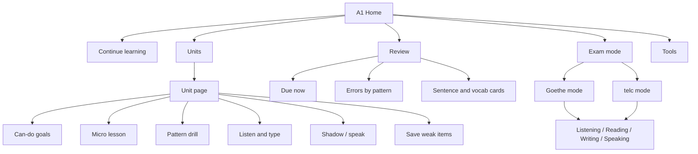
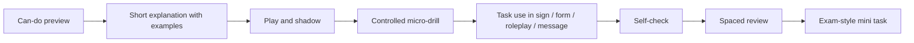

# A1 German Learning App Redesign and Content Blueprint

## Executive summary

Your current app already contains substantial value: it has an A1-to-B1 path, six A1 modules, topic pages, basics pages, a paste-and-listen reader, a dashboard framed around “A1 readiness”, and a manual review tool with hidden-answer recall. It also already recognises several exam-relevant A1 domains such as personal details, numbers/time/dates, shopping, home/city, appointments, travel, health, forms, signs, and short messages. However, the same content is currently spread across overlapping entry points — **Modules**, **Basics**, **Topics**, **Grammar**, **Dashboard**, and **Review** — which makes the information architecture heavier than it needs to be for A1 learners and weaker than it could be for exam preparation.

For A1, the target is not “know lots of German facts”; it is **perform a small set of survival tasks reliably**. The CEFR A1 global scale focuses on understanding and using familiar everyday expressions, introducing oneself and others, asking and answering simple personal questions, and coping when the interlocutor speaks slowly and clearly. Goethe and telc then operationalise that into exam sections for **listening, reading, writing, and speaking**, with practice materials structured like real exams.

The strongest redesign is therefore to turn the app into **one canonical A1 learning system with multiple modes**, not many overlapping content silos. In practice, that means: one A1 home, eight tightly-scoped A1 units, one grammar reference, one lexicon, one reader, one review system, and one exam mode. Grammar should be taught as a tool for communicative tasks rather than as a separate abstract track; this matches Goethe’s own A1 test description, which explicitly subordinates grammar to task performance.

The content side should be anchored to the **official Goethe A1 topic inventory and word list**. Goethe’s A1 vocabulary list states that the list contains roughly **650 entries**, and that a learner at this stage should actively command about **half** of them. That gives a practical app target of roughly **320 to 380 active items** for A1, with the rest available receptively in reading/listening support.

The learning-science side should prioritise **retrieval practice**, **spacing**, and **short focused lessons**. Retrieval practice outperforms concept-mapping style elaborative restudy in measured learning outcomes, and spaced review improves long-term retention in foreign-language vocabulary. Recent systematic-review work also supports microlearning as an effective structure for focused, flexible study when it is designed well.

Technically, the app can be implemented very effectively as an offline-friendly web app. Browser speech synthesis is broadly available and already supports selectable voices, language settings, and rate control, but browser-native word-boundary support is not consistently available. If you want robust per-word highlighting and precise sync, cloud TTS with SSML and word-boundary events is the more dependable option. Offline learning state should live in IndexedDB; app shell and core audio bundles should be cached with a service worker.

## Baseline diagnosis of the current app

The live app already exposes a well-considered A1 framing. The landing page presents an “A1 standards snapshot”, explicitly names eight topic buckets, targets **355 active words**, and lists six exam-shaped drills including self-presentation, form filling, number dictation, service roleplay, signs, and short messages. The dashboard reinforces the same idea by describing the A1 layer as survival communication built around sound/spelling, controlled vocabulary, reusable sentence patterns, core grammar, and exam-shaped tasks.

The main UX problem is **duplication of concept entry points**. The app has six A1 modules, seven A1 basics modules, thirteen grammar topics, four vocabulary topics, seven communication topics, a dashboard that re-summarises A1 priorities, and a review page that exposes many of the same phrases again. A beginner can plausibly ask: “Should I go to Basics, Topics, Modules, Grammar, or Dashboard first?” That is a cognitive-load problem, not a content problem.

The **Reader** is promising because it already frames the correct core use case: paste German text, split it into tappable words, show English glosses, and allow speed-controlled audio. That directly matches your original stated need. The issue is not that the reader is wrong; it is that it currently appears as a separate utility rather than as an integrated part of the A1 progression, pronunciation practice, and exam preparation loop.

The **Review** page already uses hidden-answer recall, which is the correct direction pedagogically. But it is still presented as a manual tool with reveal buttons, due counts, and card groups, rather than as a fully integrated review engine that connects mistakes back to specific grammar points, listening confusions, and exam tasks.

### Current-to-proposed feature diff

| Area | Current baseline | Main issue | Proposed direction |
|---|---|---|---|
| A1 navigation | Modules, Basics, Topics, Grammar, Dashboard, Reader, Review | Too many overlapping A1 entry points | Collapse to **A1 Home** with tabs: Learn, Practice, Review, Exam, Tools |
| A1 structure | 6 A1 modules plus separate basics/topics/grammar buckets | Content overlap and uncertainty about sequence | Replace with **8 canonical A1 units** and keep Topics/Grammar as filtered views of the same content objects |
| Reader | Paste German, tappable words, English glosses, speed control | Utility is detached from syllabus and review | Connect reader texts to unit vocabulary, grammar tags, and review scheduling |
| Review | Hidden-answer manual cards | Recall exists, but error loops are weak | Add spaced review states, self-rating, and mistake-to-remediation linking |
| Exam preparation | Dashboard mentions exam-shaped drills | Preparation is present conceptually, but not yet a dedicated mode | Add **Goethe mode** and **telc mode** with timers, answer sheets, and skill breakdown |
| Grammar | Good coverage across topics | Still feels like a separate content silo | Make grammar reference universal, but deliver grammar inside units and practice flows |
| Audio | Global speed controls and German audio throughout | Good foundation, but needs more granular audio behaviours | Add sentence play, token play, phrase play, dictation clips, and downloadable core bundles |
| Accessibility | Not enough evidence of dedicated accessibility patterns from the page structure alone | Mobile and assistive-tech optimisation should be explicit | Add larger touch targets, stronger headings/landmarks, better focus states, sticky bottom navigation, and offline status feedback |

The case for simplification is strongest because the current UI already contains the right content domains, while the CEFR and exam providers define A1 in task terms rather than in siloed “content page” terms. The redesign should therefore reduce duplication and increase task clarity.

## A1 syllabus mapping and content architecture

The official Goethe A1 topic inventory covers the following broad areas: **person**, **home/living**, **environment/weather**, **travel/transport**, **food/drink**, **shopping**, **services**, **education/learning**, **work**, and **leisure/entertainment**. Its word-group inventory additionally highlights numbers, dates, times, weekdays, months, seasons, weights/measures, countries/nationalities, colours, and useful everyday expressions. That is the correct backbone for an A1 app that wants both learning value and exam relevance.

Goethe’s A1 exam for adults assesses four skills: **listening** for short everyday conversations/messages/announcements, **reading** short notes, ads and signs, **writing** simple forms and short personal texts, and **speaking** for self-introduction plus simple everyday questions and requests. Goethe estimates that reaching this level typically takes roughly **80 to 200 lessons of 45 minutes**, depending on prior knowledge and learning conditions. telc’s A1 format is similar in purpose but differs slightly in timing: around **20 minutes listening**, **45 minutes reading and writing**, and around **15 minutes speaking**.

From those official requirements, the cleanest A1 app architecture is an **eight-unit sequence**. It is simpler than your current multi-page overlap, but still covers the complete official A1 topic space.

### Proposed A1 unit map

| Unit | Communicative outcomes | Core grammar | Core vocabulary clusters | Exam-style tasks |
|---|---|---|---|---|
| Sounds, greetings, classroom repair | greet, say name, ask for repetition, spell aloud | pronouns with **sein**, basic statements, polite forms | alphabet, umlauts, greeting formulas, countries, names | speaking self-introduction, spelling dictation |
| Personal details and forms | give address, phone, email, birth date, nationality, languages | **sein / haben**, W-questions, yes/no questions | forms, address data, numbers 0–100, countries/languages | form filling, listening for names/numbers |
| Numbers, money, date and time | say prices, dates, appointments, times | ordinals in date expressions, temporal chunks, V2 with time first | weekdays, months, seasons, times, prices, measures | number dictation, appointment parsing |
| Family, routine, study and work | describe routine, family, job, study, free time | present tense, separable verbs, **gern**, modal basics | family, jobs, daily actions, leisure verbs | routine mini-monologue, reading timetable |
| Food, shopping and payment | order, ask price, quantity, pay, state preferences | accusative basics, **möchten**, **kein / nicht** | food/drink, shops, quantities, cash/card | service roleplay, price listening |
| Home, city and directions | talk about rooms, furniture, places, simple directions | articles, noun gender, local preposition chunks | rooms, furniture, town places, direction words | signs, notices, route tasks |
| Health, appointments and services | say simple health problems, move/cancel appointments, ask help | dative chunks, modal verbs, polite request frames | doctor, pharmacy, appointment, delay, help | short message, help-seeking dialogue |
| Notes, signs and mock exam | handle notices, messages, short functional writing | sentence links, narrow Perfekt recognition/use, exam review | signs, office language, public information, review lexicon | full mini mock in listening-reading-writing-speaking |

This synthesis is consistent with the official Goethe topic inventory, the CEFR A1 action profile, and the task shapes in the relevant A1 exams.

A practical lexicon target for the app is **320 to 380 active A1 items**, with every noun stored as **article + singular + plural**, and the rest of the official A1 inventory available as receptive support in the reader and review system. Goethe’s word list explicitly treats roughly half of its c. 650 entries as the practical active target at this level.

### Skill and assessment mapping

| Skill | Official A1 expectation | App deliverable |
|---|---|---|
| Listening | understand very familiar words/phrases when spoken slowly and clearly; understand short everyday audio in exam tasks | slow audio, progressive speed, number/time/date dictation, sign and announcement listening |
| Reading | understand familiar names, words, very simple sentences, notices, posters, catalogues, short public texts | sign bank, form labels, short message reading, reader with chunk gloss support |
| Writing | fill in forms; write short simple personal or functional text | form completion templates, 2–4 sentence message builder, error-checked writing frames |
| Speaking interaction | answer simple personal questions, ask simple questions, make simple requests | roleplays, question drills, repair phrases, request frames |
| Spoken production | describe where you live and people you know in simple phrases/sentences | self-introduction blocks, home/family/routine sentence builders |

The table above is a practical translation of official CEFR A1 descriptors and Goethe/telc A1 exam tasks into app features.

## Grammar, conventions and pronunciation assets

Goethe’s A1 grammar inventory includes **verb tense and mood, modal verbs, separable-prefix verbs, noun gender/number/case, articles and pronouns, adjective use, temporal/local/modal prepositions, verb-second word order, negation, questions, and basic sentence links**. Importantly, the specification also says that grammar at this level should serve task performance rather than exist as an end in itself. That is the right design principle for your content tables.

### Core pronoun and verb tables

| Category | Forms |
|---|---|
| Personal pronouns, nominative | ich, du, er, sie, es, wir, ihr, sie, Sie |
| Personal pronouns, accusative | mich, dich, ihn, sie, es, uns, euch, sie, Sie |
| Core dative pronouns for A1 patterns | mir, dir, ihm, ihr, ihm, uns, euch, ihnen, Ihnen |
| **sein** | ich **bin**, du **bist**, er/sie/es **ist**, wir **sind**, ihr **seid**, sie/Sie **sind** |
| **haben** | ich **habe**, du **hast**, er/sie/es **hat**, wir **haben**, ihr **habt**, sie/Sie **haben** |
| Regular present endings | **-e, -st, -t, -en, -t, -en** |
| High-value modal verbs | können, wollen, müssen, dürfen, sollen, möchten |
| High-value separable verbs | aufstehen, einkaufen, anfangen, mitkommen, zumachen |

These forms expand the A1 inventory explicitly named in the Goethe specification and align with standard German reference grammar. Goethe also includes imperative forms in **du / ihr / Sie** and selected question-pronoun patterns as part of the A1 scope.

### Article, **ein**, and **kein** tables

| Case | Definite masculine | Definite feminine | Definite neuter | Definite plural |
|---|---|---|---|---|
| Nominative | der | die | das | die |
| Accusative | den | die | das | die |
| Dative | dem | der | dem | den |

| Case | Indefinite masculine | Indefinite feminine | Indefinite neuter | Negative masculine | Negative feminine | Negative neuter | Negative plural |
|---|---|---|---|---|---|---|---|
| Nominative | ein | eine | ein | kein | keine | kein | keine |
| Accusative | einen | eine | ein | keinen | keine | kein | keine |
| Dative | einem | einer | einem | keinem | keiner | keinem | keinen |

For A1 production, this table is the minimum useful system. Goethe’s A1 grammar inventory includes nominative, accusative and dative, while genitive is only a receptive priority. The app should therefore **teach Nominativ and Akkusativ first**, then introduce **high-frequency dative chunks**, then reference full dative tables when needed.

### Noun gender, plural and storage rules

| Item | App rule |
|---|---|
| Noun storage | Always store as **article + singular + plural + translation + example sentence** |
| Gender learning | Teach article with every noun; do not store bare nouns in the learner lexicon |
| Feminine pattern hints | endings such as **-ung, -heit, -keit, -schaft, -ion, -ei** are highly useful heuristics |
| Neuter pattern hints | **-chen, -lein, infinitive-as-noun** are useful heuristics |
| Masculine pattern hints | days, months, many weather terms, and many profession/person labels are high-frequency patterns worth teaching |
| Plural strategy | Learn the plural lexically; give pattern hints only as secondary support |
| Core plural hints | many feminines take **-(e)n**; many masculine/neuter nouns take **-e**; some nouns take **-er** or zero plural; umlaut must be learned with the noun |

This approach is safer than teaching overconfident “gender rules”, because German gender and plural formation are only partly predictable. Goethe’s own A1 materials emphasise article-linked noun learning and include plural forms “where relevant”. Duden’s reference materials likewise show plural formation as patterned but not fully rule-based.

### Sentence patterns and tense scope

| Category | A1 priority | Content rule for the app |
|---|---|---|
| Verb-second statements | very high | teach from the start: **Heute lerne ich Deutsch** |
| Yes/no questions | very high | finite verb first: **Hast du Zeit?** |
| W-questions | very high | **wie, wo, woher, wohin, wann, was, wer, wem** |
| Negation | very high | contrast **nicht** vs **kein** early |
| Sentence links | high | **und, oder, aber, denn, dann**; keep them practical |
| Present tense | core productive tense | all A1 units should be primarily in Präsens |
| Perfekt | limited active, wider recognition | teach a **small productive package** plus strong receptive support |
| Präteritum | minimal productive | prioritise **war / hatte** recognition and light use |

This is one of the most important exam-prep decisions. Goethe’s A1 inventory includes **Präsens for all verbs in scope**, **Perfekt for a selected set of common verbs**, and selected **Präteritum** forms of **haben/sein**. That means an exam-focused A1 app should not overload the learner with a full past-tense paradigm too early; it should use a **narrow past-time package** instead.

### Recommended Perfekt starter set

Start active Perfekt with:

- **haben** + participle: gemacht, gelernt, gelesen, gefragt, gesehen, getrunken
- **sein** + participle: geblieben, gefahren, passiert

Then treat **war** and **hatte** as high-frequency support forms for everyday narratives like illness, absence, and appointments. This is close to the official A1 inventory and avoids premature overload.

### Conventions for numbers, date, time and formatting

| Domain | Convention to teach |
|---|---|
| 21, 31, 41… | one-and-twenty structure: **einundzwanzig**, **einunddreißig** |
| Ordinals in dates | **am ersten März**, **am dritten Mai** |
| Formal time | **08:30 Uhr**, **19:30 Uhr** |
| Spoken time | **halb zehn**, **Viertel nach zwei**, **Viertel vor zwei** |
| Weekday + date writing | teach both understanding and clean written forms |
| Prices and measures | train digits and spoken equivalents together |
| Numbers in forms | use numerals in dates, prices, years, measures, addresses, codes |

The Goethe A1 word list explicitly includes numbers, dates, clock time, weekdays, months, seasons, currencies, measures and weights as core word groups. Duden’s guidance on dates, number writing, and time formatting is useful for normalised display rules inside the app.

### Pronunciation notes for A1

| Pattern | Teach it as | Example focus |
|---|---|---|
| ä, ö, ü | distinct vowel targets, not decorative spellings | **fünf, schön, spät** |
| ei / ai | one sound family | **mein, Mai** |
| ie | long **i** target | **vier, sieben** |
| eu / äu | one sound family | **neu, Häuser** |
| sch | stable high-value cluster | **schon, Schule** |
| sp / st at word start | special German onset pattern | **Spiel, Straße** |
| z / tz | **ts** sound family | **Zeit, Platz** |
| ß | same sound family as **ss**, but different spelling distribution | **Straße** |
| v in common native words | often pronounced like **f** | **Vater** |

For the app, the goal should be **usable sound categories with audio exemplars**, not heavy phonetic theory. Focus on minimal pairs, spelling aloud, and common A1 words learners actually need. Duden materials for standard pronunciation and orthography support the high-value patterns above, especially diphthongs, word-initial **sp/st**, and common sound-letter correspondences.

## Audio and interaction design

Your original instinct about audio was correct. A German-learning app at A1 should support **whole-sentence playback**, **single-word playback**, **speed variation**, and **immediate meaning support**. The official A1 scope is full of number-heavy and phrase-heavy tasks — dates, times, signs, forms, short requests, short messages — so sound-to-text mapping is not optional.

The biggest content adjustment I recommend is this: **do not make word-by-word translation the default reading mode**. Keep it available, but make the primary mode **German sentence → phrase chunks → optional word glosses**. CEFR A1 performance is largely formulaic and task-based, and Goethe’s A1 design repeatedly asks the learner to understand short whole messages, not just isolated lexical items. The right compromise is a reader that starts at sentence or phrase level, then lets the learner drill down to token level on tap.

### Recommended reader interaction model

1. Show the full German sentence first.
2. Offer **Play sentence**.
3. Segment into phrase chunks under the line.
4. Let each token open a card with lemma, gloss, article/plural if a noun, POS tag, and **Play word**.
5. Let the learner toggle **literal gloss** vs **natural translation**.
6. Offer **shadow**, **dictation**, and **save to review** actions.

This preserves chunk learning while still serving the “tap a word and understand it now” use case. It also makes the Reader a bridge into review and exam practice instead of a detached tool.

### TTS stack comparison

| Option | Best use | Strengths | Weaknesses |
|---|---|---|---|
| Browser-native speech synthesis | fast MVP, offline-ish local voices, zero backend for basic playback | widely available; voice selection via `getVoices()`; supports utterance language and rate | voice quality and availability vary by device/browser; precise boundary events are not consistently available |
| Cloud TTS with SSML | production audio, consistent voice quality, pre-generated lesson audio | supports SSML for pauses and special reading of dates/times/abbreviations; easier to normalise content | cost, network dependency unless cached/downloaded |
| Cloud TTS with word-boundary events | per-word highlighting, karaoke-style follow-along, precise analytics | precise token-sync is easier to implement | most complex and most infrastructure-heavy |

MDN documents browser-native speech synthesis as widely available, including voice selection and language/rate settings. However, MDN also marks browser-native `boundary` events as limited-availability. By contrast, Azure documents word-boundary events for speech synthesis, and Google documents SSML support including dates, times, abbreviations and pauses.

### Audio requirements for the app

| Asset type | Requirement |
|---|---|
| Sentence audio | every example sentence and exercise prompt |
| Token audio | every vocab item; every word in reader when tapped |
| Phrase audio | roleplay chunks, signs, notices, appointment lines |
| Speed profiles | 0.5×, 0.75×, 1.0×, 1.25× minimum; 0.25× optional only for hard dictation work |
| Dictation clips | phone numbers, prices, dates, times, addresses |
| Download bundle | all A1 core audio available as a cached pack for offline learning |
| Voice consistency | one primary learner voice and optionally one secondary exam voice |

Those requirements follow from the official A1 inventories and the current capabilities your app is already trying to deliver.

### Helpful extra feature for pronunciation learning

Add a **record-and-compare** mode before adding live speech recognition. `MediaRecorder` and the Web Audio API are broadly available and are enough to let the learner record themselves, replay the audio, and compare waveforms or energy contours. Browser speech recognition is still limited in availability, so it should be treated as optional enrichment rather than an A1-critical dependency.

## UX, UI and learning flow

The redesign goal is to make the app feel less like a document library and more like a **training system**. The learner should always know three things:

- what to learn now,
- what to review now,
- how close they are to an actual A1 task.

That is especially important because Goethe and telc both provide structured exam practice, and Goethe explicitly offers accessible digital exam training. Your app should feel like preparation for that reality, not like a loose collection of notes.

### Recommended information architecture



This IA reduces duplication by making **Units** the canonical learning objects, with **Grammar**, **Topics**, and **Vocabulary** turning into filters or indexes over the same underlying content rather than separate silos. That recommendation follows directly from the overlap visible in the current live structure.

### Recommended lesson loop



This loop is justified by both the official A1 task profile and the learning-science evidence for retrieval and spacing. In other words: learn a small chunk, use it quickly, retrieve it later, then test it in an exam-like context.

### UX rules I would implement first

First, replace separate “Basics”, “Topics”, and “Grammar” landing pages with **tabs on the A1 home**. The learner can still browse by topic or grammar, but the system should not ask them to choose among multiple competing A1 pathways before they know German. That is a UX simplification that matches the current overlap evident in the site map.

Second, make every unit follow the same internal structure: **Can do → Learn → Listen → Drill → Use → Review → Exam link**. Consistency matters more than cleverness at A1 because the learner’s mental energy is already being spent on decoding a new language.

Third, add a **bilingual-to-German practice mode**. Keep navigation and safety-critical instructions clear in English, but let drills, prompts, short labels, and answer choices gradually shift toward German once the concept is understood. Official exams are not scaffolded in English, so the practice environment should reduce translation support over time without making the interface feel hostile to beginners.

Fourth, turn review into a **mistake-driven system**. If the learner misses **einen / ein**, confuses **um halb elf**, or mishears a phone number, the app should generate next-day micro-review items specifically for that error pattern. That is a stronger use of the existing reveal-based review concept.

### Accessibility and mobile responsiveness

Headings should be deeply cleaned up and used as true page structure, because WAI emphasises that headings communicate organisation and support assistive-technology navigation. For long unit pages, add an in-page table of contents so learners can jump directly to grammar, vocabulary, listening, or review.

For touch UI, follow WCAG 2.2 target-size guidance. At minimum, interactive controls should effectively meet **24 by 24 CSS pixels**, and for primary actions on mobile it is wise to aim closer to the enhanced **44 by 44 CSS pixels** where layout allows. This is especially important for audio controls, reveal buttons, and vocabulary chips.

On mobile, I would use a **sticky bottom bar** for the five highest-value actions: **Home, Continue, Review, Reader, Exam**. Audio speed, voice settings, and translation display belong inside drawers or secondary settings, not as primary top-level clutter. This is an inference from the current information density and from the fact that A1 learners need a stable home base more than flexible navigation complexity.

## Implementation-ready assets and roadmap

The app will be much easier to evolve if everything is treated as structured content rather than hand-written page prose. The core content objects should be **units**, **lessons**, **vocab items**, **example sentences**, **exercise templates**, **review cards**, and **audio assets**. That will let you feed material to Codex cleanly and generate pages, quizzes, and updates from the same source of truth. The official A1 inventories already lend themselves to that kind of normalisation.

### Recommended vocab CSV schema

```csv
id,cefr,topic,subtopic,pos,lemma,article,plural,english,gloss_tc,example_de,example_en,example_tc,audio_word,audio_example,gender,case_pattern,tags,source_ref
a1_v_0001,A1,personal_details,name,noun,Name,der,Namen,name,名字,Mein Name ist Lin.,My name is Lin.,我叫 Lin。,audio/word/name.mp3,audio/ex/name-01.mp3,m,regular,form;identity,goethe_a1
a1_v_0002,A1,time_date,weekday,noun,Montag,der,Montage,Monday,星期一,Der Termin ist am Montag.,The appointment is on Monday.,約會在星期一。,audio/word/montag.mp3,audio/ex/montag-01.mp3,m,time_word,calendar;appointment,goethe_a1
a1_v_0003,A1,time_date,time,noun,Uhr,die,Uhren,clock;o'clock,時鐘；點鐘,Es ist neun Uhr.,It is nine o'clock.,現在九點。,audio/word/uhr.mp3,audio/ex/uhr-01.mp3,f,time_word,clock,goethe_a1
a1_v_0004,A1,shopping,drink,noun,Kaffee,der,-,coffee,咖啡,Ich möchte einen Kaffee.,I would like a coffee.,我想要一杯咖啡。,audio/word/kaffee.mp3,audio/ex/kaffee-01.mp3,m,accusative_target,food;service,goethe_a1
a1_v_0005,A1,services,appointment,noun,Termin,der,Termine,appointment,約會；預約,Ich habe einen Termin.,I have an appointment.,我有一個預約。,audio/word/termin.mp3,audio/ex/termin-01.mp3,m,accusative_target,service;time,goethe_a1
a1_v_0006,A1,travel,transport,noun,Zug,der,Züge,train,火車,Ich fahre mit dem Zug.,I go by train.,我坐火車去。,audio/word/zug.mp3,audio/ex/zug-01.mp3,m,dative_chunk,travel,goethe_a1
a1_v_0007,A1,grammar,question,pronoun,woher,,,where from,從哪裡,Woher kommen Sie?,Where do you come from?,您從哪裡來？,audio/word/woher.mp3,audio/ex/woher-01.mp3,,question,questions,goethe_a1
a1_v_0008,A1,health,problem,adjective,krank,,,ill,sick,生病,Ich bin krank.,I am ill.,我生病了。,audio/word/krank.mp3,audio/ex/krank-01.mp3,,predicative,health,goethe_a1
```

This schema matches official A1 needs particularly well because Goethe expects nouns with article knowledge, plural awareness where relevant, and everyday-form task readiness.

### Recommended sentence JSON schema

```json
{
  "id": "a1_s_0103",
  "cefr": "A1",
  "unit": "numbers-money-date-time",
  "skillTags": ["listening", "writing", "appointment"],
  "de": "Der Termin ist am Montag um halb elf.",
  "translation_natural_en": "The appointment is on Monday at half past ten.",
  "translation_literal_en": "The appointment is on Monday at half eleven.",
  "tokens": [
    { "surface": "Der", "lemma": "der", "pos": "article", "gloss": "the" },
    { "surface": "Termin", "lemma": "Termin", "pos": "noun", "article": "der", "plural": "Termine", "gloss": "appointment" },
    { "surface": "ist", "lemma": "sein", "pos": "verb", "gloss": "is" },
    { "surface": "am", "lemma": "an + dem", "pos": "prep+article", "gloss": "on the" },
    { "surface": "Montag", "lemma": "Montag", "pos": "noun", "article": "der", "gloss": "Monday" },
    { "surface": "um", "lemma": "um", "pos": "preposition", "gloss": "at" },
    { "surface": "halb", "lemma": "halb", "pos": "adverb", "gloss": "half" },
    { "surface": "elf", "lemma": "elf", "pos": "number", "gloss": "eleven" }
  ],
  "audio": {
    "mode": "pre_generated",
    "lang": "de-DE",
    "voice": "de-DE-primary",
    "rates": [0.5, 0.75, 1.0, 1.25],
    "sentenceFiles": {
      "0.5": "audio/a1_s_0103_050.mp3",
      "0.75": "audio/a1_s_0103_075.mp3",
      "1.0": "audio/a1_s_0103_100.mp3"
    }
  },
  "review": {
    "cardType": "dictation",
    "prompt": "Write the weekday and time.",
    "answers": ["Montag, 10:30", "Montag, halb elf"]
  },
  "sourceRef": "goethe_a1_time_inventory"
}
```

### Recommended unit JSON schema

```json
{
  "id": "a1_u03_numbers_money_date_time",
  "cefr": "A1",
  "title": "Numbers, money, date and time",
  "canDo": [
    "I can understand and say prices.",
    "I can understand and say weekdays, months and simple dates.",
    "I can understand and say appointment times."
  ],
  "grammarFocus": [
    "numbers",
    "ordinals in dates",
    "time expressions",
    "verb-second with time phrase first"
  ],
  "vocabSets": [
    "numbers_0_100",
    "weekdays",
    "months",
    "seasons",
    "prices",
    "weights_measures"
  ],
  "exerciseTypes": [
    "listen_repeat",
    "dictation_time",
    "date_builder",
    "micro_roleplay",
    "reader_chunk_tap"
  ],
  "examLinks": [
    "goethe_listening_numbers",
    "goethe_writing_form",
    "telc_listening_appointments"
  ]
}
```

### Prioritised roadmap

The first release should not try to ship the whole blueprint at once. Treat the roadmap as a sequence of vertical slices: prove the content model, migrate one excellent unit, connect it to review, then expand the same pattern across the remaining A1 units.

| Priority | Deliverable | Why it matters | Implementation note |
|---|---|---|---|
| P0.1 | Formalise vocab, sentence, unit, exercise, and review schemas | prevents another round of duplicated page prose | store article/plural/example with every noun; keep stable IDs from the start |
| P0.2 | Collapse A1 IA into one canonical A1 home | biggest UX gain for least content rewrite | keep existing content, but re-index it as unit tabs and filtered views |
| P0.3 | Migrate one complete pilot unit | proves the content loop before broad migration | use “Numbers, money, date and time” because it touches listening, forms, appointments, and review |
| P0.4 | Upgrade review from manual reveal cards to scheduled review | strongest learning gain after IA cleanup | add self-rating, due dates, and links back to the exact unit/pattern missed |
| P0.5 | Add an exam-mode shell | makes the product feel exam-directed early | mirror Goethe/telc skill flows and timers, initially using pilot-unit content |
| P1 | Reader integration with unit/review tagging | turns utility into learning engine | save reader items into review and topic views |
| P1 | Pre-generated core A1 audio bundle | better consistency and offline reliability | cache via service worker; keep native TTS fallback |
| P1 | Dictation bank for numbers/time/date/forms | directly exam relevant | author 100–200 short clips |
| P1 | Expand the remaining seven A1 units | completes the canonical sequence | migrate and QA one unit at a time using the pilot-unit template |
| P1 | Pronunciation record-and-compare | helpful extra feature without fragile live ASR dependency | use MediaRecorder + Web Audio |
| P2 | Optional live speech recognition | nice-to-have only | treat as experimental and browser-dependent |
| P2 | Cloud word-boundary highlighting | premium UX for follow-along reading | use Azure word-boundary events or equivalent |
| P2 | APKG/Anki export | future-proof review portability | keep IDs stable from the start |

### First build-slice acceptance criteria

The first implementation slice is done when:

- the learner lands on a single A1 home and can continue one pilot unit without choosing among Basics, Topics, Modules, Grammar, and Dashboard;
- the pilot unit uses the structured vocab, sentence, unit, exercise, and review schemas rather than hand-written duplicated page content;
- each noun in the pilot unit carries article, singular, plural, translation, and at least one example sentence;
- review state persists locally and can schedule due cards from both lesson mistakes and saved reader items;
- the exam-mode shell exposes listening, reading, writing, and speaking sections with timers, even if only pilot-unit tasks are populated at first;
- the reader can save a tapped word, phrase, or sentence into review with unit and grammar tags;
- mobile navigation exposes Home, Continue, Review, Reader, and Exam as stable primary actions;
- the pilot flow has keyboard/focus states and touch targets that meet WCAG 2.2 target-size guidance.

### APIs, libraries and offline support

For the browser stack, the highest-value native APIs are:

- **SpeechSynthesis / SpeechSynthesisUtterance** for quick TTS, voice selection, language setting, and rate control.
- **Service Worker + Cache API** for offline shell and audio caching. MDN explicitly describes the install event as the moment to create caches for offline use.
- **IndexedDB** for persistent learner state and decks, including offline use.
- **Intl.DateTimeFormat** and **Intl.NumberFormat** for locale-sensitive display formatting, with custom German text renderers layered on top for spoken norms.
- **Intl.Segmenter** for locale-sensitive tokenisation in the Reader, with fallback tokenisation for older browsers because MDN marks it as Baseline 2024 rather than universally old-browser safe.
- **Intl.DisplayNames** if you want accurate display names for languages and regions in bilingual glosses and forms.

If you want helper libraries, the safest optional additions are:

- **Workbox** for easier service-worker precaching and offline support.
- **Dexie** as an IndexedDB wrapper if you want cleaner local database code and easier export/import flows.

## Open questions and limitations

This report provides a **framework-level A1 blueprint and starter data model**, but it does **not reproduce the full official Goethe A1 word list verbatim**. For production content, the best route is to ingest the official list as your master lexicon source, then normalise it into the schemas above. Goethe explicitly provides both the A1 vocabulary list and free A1 exam training materials for that purpose.

The live app was inspected structurally through its published pages, not through device-by-device visual QA. That means the report is high-confidence on **architecture, content overlap, and learning design**, but lower-confidence on pixel-level visual polish issues that only appear on specific screens or breakpoints.

The pronunciation section is intentionally practical rather than exhaustive. For A1, that is a strength, not a weakness: the official goal is elementary task performance with basic structures and familiar expressions, not advanced phonetics.

## Sources and reference links

The broken internal browsing citations from the draft have been replaced with this stable source list. If the report is published externally, add direct links to the inspected app pages as a separate “Current app evidence” appendix.

### A1, CEFR and exam references

- Council of Europe: [CEFR Global Scale, Table 1](https://www.coe.int/en/web/common-European-framework-reference-languages/table-1-cefr-3.3-common-reference-levels-global-scale)
- Goethe-Institut: [Goethe-Zertifikat A1: Start Deutsch 1](https://www.goethe.de/ins/us/en/spr/prf/gzsd1.cfm)
- Goethe-Institut: [Goethe-Zertifikat A1: Prüfungsziele / Testbeschreibung PDF](https://www.goethe.de/pro/relaunch/prf/en/Pruefungsziele_Testbeschreibung_A1_SD1.pdf)
- telc: [Start Deutsch 1 / telc Deutsch A1](https://www.telc.net/en/language-examinations/certificate-exams/german/start-german1-telc-german-a1/)

### Learning-science references

- Karpicke and Blunt, 2011: [Retrieval Practice Produces More Learning than Elaborative Studying with Concept Mapping](https://pubmed.ncbi.nlm.nih.gov/21252317/)
- Roediger and Butler, 2011: [The Critical Role of Retrieval Practice in Long-Term Retention](https://pubmed.ncbi.nlm.nih.gov/20951630/)
- Kim and Webb, 2022: [The Effects of Spaced Practice on Second Language Learning: A Meta-Analysis](https://onlinelibrary.wiley.com/doi/abs/10.1111/lang.12479)
- Nakata and Elgort, 2021: [Effects of Spacing on Contextual Vocabulary Learning](https://journals.sagepub.com/doi/10.1177/0267658320927764)
- Monib, Qazi and Apong, 2024/2025: [Microlearning Beyond Boundaries: A Systematic Review and a Novel Framework for Improving Learning Outcomes](https://pubmed.ncbi.nlm.nih.gov/39882484/)

### Web platform and implementation references

- MDN: [SpeechSynthesis](https://developer.mozilla.org/en-US/docs/Web/API/SpeechSynthesis)
- MDN: [SpeechSynthesisUtterance boundary event](https://developer.mozilla.org/en-US/docs/Web/API/SpeechSynthesisUtterance/boundary_event)
- Microsoft Learn: [Azure Speech synthesis and word-boundary events](https://learn.microsoft.com/en-sg/azure/ai-services/speech-service/how-to-speech-synthesis)
- Google Cloud: [Text-to-Speech SSML](https://docs.cloud.google.com/text-to-speech/docs/ssml)
- MDN: [Service Worker API](https://developer.mozilla.org/en-US/docs/Web/API/Service_Worker_API)
- MDN: [Cache API](https://developer.mozilla.org/en-US/docs/Web/API/Cache)
- MDN: [IndexedDB API](https://developer.mozilla.org/en-US/docs/Web/API/IndexedDB_API)
- MDN: [Intl.Segmenter](https://developer.mozilla.org/en-US/docs/Web/JavaScript/Reference/Global_Objects/Intl/Segmenter)
- MDN: [MediaRecorder](https://developer.mozilla.org/en-US/docs/Web/API/MediaRecorder)
- Workbox: [Workbox documentation](https://developer.chrome.com/docs/workbox)
- Dexie: [Dexie.js documentation](https://dexie.org/docs/)

### Accessibility references

- WAI: [Page structure and headings](https://www.w3.org/WAI/tutorials/page-structure/headings/)
- WCAG 2.2: [Target Size (Minimum)](https://www.w3.org/WAI/WCAG22/Understanding/target-size-minimum.html)
- WCAG 2.2: [Target Size (Enhanced)](https://www.w3.org/WAI/WCAG22/Understanding/target-size-enhanced.html)
